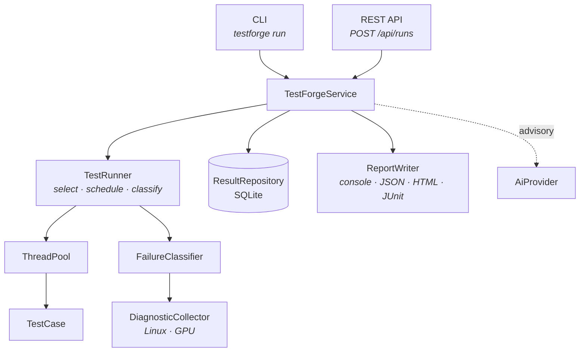

# TestForge

A C++20 test automation and validation engine for HTTP services. It executes
tests concurrently with per-test timeouts and cooperative cancellation,
classifies every failure by cause, captures system diagnostics at the moment of
failure, and persists results so regressions and flaky tests are queryable
rather than anecdotal.

| | |
|---|---|
| **Language** | C++20 (GCC 11+ / Clang 14+), CMake 3.20+ |
| **Platform** | Linux |
| **Runtime dependencies** | None. JSON, HTTP client and HTTP server are part of the project |
| **Build dependencies** | GoogleTest and SQLite, fetched and hash-pinned by CMake |
| **Tests** | 395 GoogleTest cases, clean under ASan, UBSan and ThreadSanitizer |
| **Licence** | MIT |

---

## Overview

A test suite that reports `FAILED` has moved the problem rather than solved it.
Somebody still has to determine whether the service is broken, the network
dropped a connection, the machine ran out of disk, or the test itself is
unreliable. That triage is where the time goes, and it is what TestForge is
built to shorten.

Three things follow from that goal:

**Failures are classified, not just counted.** Each failure is assigned a cause
— assertion, timeout, network, dependency, environment, resource,
configuration, application, or framework — derived from the exception type, the
transport-level error, and the metadata the test recorded. An
`ASSERTION_FAILURE` and a `NETWORK_FAILURE` send an engineer to different
places.

**Evidence is captured while it is still true.** CPU, memory, load, disk,
network interfaces and GPU state are collected at the point of failure, not
reconstructed afterwards from a timestamp.

**Results persist.** Every run is written to SQLite, so "has this failed
before?" and "is this flaky or genuinely broken?" are queries.

The engine has no third-party runtime dependencies. The JSON parser, HTTP
client and HTTP server are part of the project, which means it builds and runs
on a machine that has a compiler and nothing else.

## Key Features

| Area | Capability |
|---|---|
| Execution | Fixed worker pool, per-test timeouts, cooperative cancellation, retry-on-failure |
| Selection | Suite, tag, name glob, seeded shuffle, stable hash-based sharding |
| Failure handling | Nine-category classification, two-pass refinement, diagnostics attached to the result |
| Assertions | 17 assertion functions, signed/unsigned-correct comparison, soft assertions |
| Linux diagnostics | `/proc`, `/sys`, `getifaddrs`, `statvfs`, `uname`, cgroup container detection |
| GPU diagnostics | NVIDIA state via `nvidia-smi`, behind a provider interface |
| Persistence | SQLite with versioned migrations, WAL, prepared statements |
| Reporting | Console, JSON, HTML, JUnit XML; aggregate analytics; flake detection |
| Interfaces | 12-command CLI, 16-endpoint REST API, browser dashboard |
| AI assistance | Test generation and failure analysis through a validated, advisory-only boundary |
| CI | Deterministic exit codes, sharding, machine-readable output, sanitizer builds |

## Architecture



The execution path is the same regardless of entry point:

```
CLI or REST → TestForgeService → TestRunner → ThreadPool → TestCase
                                     ↓
                              TestResult → FailureClassifier → DiagnosticCollector
                                     ↓
                          ResultRepository (SQLite) + ReportWriter
```

`TestForgeService` is the only entry point either interface uses, so
`testforge run --suite api` and `POST /api/runs` cannot drift apart.

The engine depends on interfaces rather than implementations —
`ResultRepository`, `DiagnosticProvider`, `GpuDiagnosticProvider`, `AiProvider`,
`Reporter`. Each has more than one implementation in the repository, and the
second is usually what makes the first testable: `InMemoryRepository` lets the
runner be exercised with no database, and `MockGpuProvider` lets the GPU
reporting path be exercised with no GPU.

The AI sidecar is deliberately out of process. The C++ engine links no TLS
stack and speaks plain HTTP to a local Python service, which owns the model
client. See [AI-Assisted Testing](#ai-assisted-testing).

Detail: [docs/architecture.md](docs/architecture.md).

## Concurrency Model

A fixed pool of worker threads is created at construction and joined at
destruction; threads are never created per task. One mutex guards the task
queue, the pending count and the stop flag, and a condition variable parks idle
workers so they consume no CPU. `submit()` returns a `std::future`, so a caller
can wait on one specific task.

A test with a timeout runs on a helper thread, which lets the worker stop
waiting at the deadline. A test without one runs inline on the worker.

**Cancellation is cooperative.** Forcibly terminating a thread leaves mutexes
locked and destructors unrun, which makes every verdict the process reports
afterwards suspect. A timed-out test is asked to stop, given a grace period to
unwind, and abandoned if it refuses — then named at shutdown. The result says
which happened.

```cpp
ctx.throwIfCancelled();            // between logical steps
ctx.sleepFor(Milliseconds{100});   // instead of std::this_thread::sleep_for
api.get("/slow");                  // the HTTP client honours the token
```

Shutdown has two modes. `shutdown()` drains the queue; `shutdownNow()` discards
what is queued and waits only for what is already running, decrementing the
pending count for each dropped task so `waitIdle()` cannot hang. Both are safe
to call twice and from more than one thread.

An interrupted run never exits `0`. `SIGINT` and `SIGTERM` stop the runner from
starting new work, keep the results already collected, mark the remainder
skipped, and exit `128 + signal`.

Detail: [docs/concurrency.md](docs/concurrency.md).

## Failure Classification & Diagnostics

When a test fails, the classifier assigns a category from the exception type
and the transport-level error, then refines it using the metadata the test
recorded — an assertion that failed against an HTTP 503 is an application
failure, not a test bug. A specificity ordering prevents a vaguer category from
overwriting a sharper one.

Diagnostics are collected at the point of failure and attached to the result.
On Linux the sources are read directly rather than shelled out to: `/proc/stat`,
`/proc/meminfo`, `/proc/loadavg`, `/proc/mounts`, `/proc/self/status`,
`/proc/1/cgroup` for container detection, `/sys/class/net/*/statistics/*`, plus
`uname(2)`, `sysconf`, `statvfs` and `getifaddrs`. Every read is byte-capped.
Where a source needs elevated privileges, the failure explains itself rather
than returning nothing:

```
journalctl unavailable (exit 1) - this normally means the current user is not
in the systemd-journal group
```

GPU state is collected through `nvidia-smi` behind a provider interface. Values
a card does not expose are reported as unknown rather than zero, so a report
cannot claim a GPU is at 0 °C. On a machine with no driver the collector says
so explicitly.

## AI-Assisted Testing

TestForge can propose API tests from a written requirement and summarise a
failure. **The C++ engine remains authoritative for pass and fail** — no
AI-produced value reaches `TestRun::exitCode()`, and every AI field in a report
is labelled advisory.

The boundary has four layers, and the last two do not depend on the model
behaving:

1. Untrusted text travels in a user message as a JSON envelope, never
   concatenated into the system prompt.
2. The provider requests structured output, which constrains syntax.
3. `SpecValidator` allow-lists HTTP methods and assertion kinds, requires
   relative endpoints, rejects protocol-relative URLs, `..`, `@` and control
   characters, denies routing and credential headers, and re-checks the
   resolved endpoint against the URL policy.
4. `registerSpecSuite` validates again rather than trusting its caller.

A validated specification becomes a `SpecTestCase`, an interpreter over a
closed nine-member assertion enum. There is no code generation, compilation,
`eval` or `dlopen` in that path, so the only effect available to a generated
test is one HTTP request to a validated relative path.

Fed a deliberately hostile specification, the validator reports each rejection:

```
error: the specification was rejected
  accepted              0
  rejected              4
  rejected  tests[0].endpoint: endpoint must be a path beginning with '/' — absolute
            URLs are not allowed, so a generated test cannot choose its own target host
  rejected  tests[2].method: method 'TRACE' is not allowed
            (allowed: GET, POST, PUT, PATCH, DELETE, HEAD, OPTIONS)
  rejected  tests[3].headers: header 'Authorization' may not be set by a generated test
```

A deterministic mock provider implements the same interface, so the whole
generate → validate → register → execute pipeline runs offline and is what the
test suite and CI exercise. Live generation requires `OPENAI_API_KEY` and the
Python sidecar.

This is a single request/response integration. There is no agent loop and no
tool calling. Detail: [docs/ai-architecture.md](docs/ai-architecture.md).

## Persistence & Reporting

Results are written to SQLite through a `ResultRepository` interface. The
schema has three tables and six indexes, with forward-only versioned migrations
applied inside a transaction and recorded in `schema_version`. WAL mode lets the
dashboard and `testforge history` read while a run is writing; `BEGIN IMMEDIATE`
is used for writes, with a busy timeout for cross-process contention and a mutex
in-process. Every user-supplied value is bound, never interpolated.

Persistence never blocks a verdict: a database error is logged and the run
continues, because the results are the product and the database is a
convenience.

Reports are produced as console output, JSON, HTML, and JUnit XML. Analytics
across runs cover pass rate, duration percentiles, failure-category breakdown,
and a flake heuristic based on the pass/fail flip rate over a test's recent
history.

## CLI / REST API

```
testforge <command> [options]

  list      run       report     diagnose   history   stats
  serve     ai        spec       db         version   help
```

```bash
testforge run --suite api --workers 4
testforge run --exclude-suite failure_injection --shards 4 --shard 0
testforge diagnose --json
testforge history --limit 10
testforge stats
testforge serve --port 8080
```

Exit codes are part of the contract:

| Code | Meaning |
|---|---|
| `0` | every test passed |
| `1` | the run completed and tests failed |
| `2` | bad arguments or configuration |
| `3` | TestForge itself failed |
| `130` / `143` | interrupted by `SIGINT` / `SIGTERM` before finishing |

The REST API serves 16 endpoints on loopback, including `GET /api/tests`,
`GET /api/runs/:id/results`, `GET /api/stats`, `GET /api/flaky`,
`GET /api/diagnostics` and `POST /api/runs`. It returns `409` if a run is
already in progress, and `200` with the verdict in the body when tests fail —
the request succeeded, the system under test did not.

## Validation

Everything below was executed locally on Ubuntu 22.04 (WSL2) with GCC 11.4.

| Check | Result |
|---|---|
| Clean configure and build, `-Werror` | 0 warnings, 0 errors |
| GoogleTest suite (`ctest`) | 395 / 395 passing |
| AddressSanitizer + UBSan, leak detection on | 0 reports |
| ThreadSanitizer | 0 warnings |
| `clang-format` 14 (the version CI installs) | clean across 120 files |
| `pytest` (sample service) | 27 / 27 passing |
| `ruff check` / `ruff format` | clean at the current release and the version CI pins |
| Secret scan | clean |
| Failure-injection negative check | exits `1` and produces all seven required categories |
| CLI and REST smoke tests | all commands and endpoints respond as documented |

The GitHub Actions workflow definitions are committed, and every command inside
them has been validated locally. The workflows themselves have not been executed
on GitHub.

Container images are configuration: the `Dockerfile`s and `docker-compose.yml`
are written and parse, but have not been built.

## Performance

Scheduling throughput measured with the bundled benchmark
(`scripts/benchmark.sh`), 48 synthetic tests of 40 ms each, median of 3 repeats,
on an Intel i3-4005U (4 logical cores, 2 physical) under WSL2 on an otherwise
idle machine.

| Workers | I/O-bound | CPU-bound |
|---:|---:|---:|
| 1 | 1.00× | 1.00× |
| 2 | 1.97× | 1.81× |
| 4 | 3.84× | 2.53× |
| 8 | **7.25×** | 2.68× |

Both workloads are reported because either one alone would misrepresent the
other: I/O-bound work scales past the core count, CPU-bound work plateaus at it,
which is the expected shape. These are synthetic scheduling measurements on a
dual-core laptop, not a throughput figure for production hardware.

## Quick Start

```bash
git clone <repository-url> testforge
cd testforge

cmake -S . -B build -DCMAKE_BUILD_TYPE=RelWithDebInfo
cmake --build build --parallel

ctest --test-dir build --output-on-failure

./build/testforge --help
./build/testforge run --suite smoke
```

GoogleTest and the SQLite amalgamation are fetched by CMake on the first
configure and verified against pinned hashes. No system packages are required.

Requires CMake 3.20 or newer and a C++20 compiler (GCC 11+ / Clang 14+). On a
machine with less than roughly 1 GB of RAM per core, bound the build with
`--parallel 2`: several translation units are template-heavy, and an unbounded
parallel build can exhaust memory.

To exercise the API suite against the bundled sample service:

```bash
pip install -r sample-service/requirements.txt
uvicorn app.main:app --port 8000 --app-dir sample-service &
./build/testforge run --suite api --workers 4
```

`scripts/demo.sh` runs the whole pipeline end to end, including the
deliberately-failing suite.

## Example

Running the smoke suite:

```
$ ./build/testforge run --suite smoke --no-color

========================================================================
TestForge Test Report
========================================================================
Run       49b861d73009a99ddb2ede8a6eac70fe
Duration  13ms  (4 workers)
Filter    --suite smoke

Total     6
Passed    6
Failed    0

Success   [########################] 100.0%

Timing    average 2ms   median 1ms   p95 11ms
          slowest smoke.cancellation_is_observed (11ms)
          test-time / wall-time 1.15x across 4 workers

========================================================================
RESULT: PASS
========================================================================
```

The `failure_injection` suite exists to demonstrate classification. Every test
in it is expected to fail, one per category:

```
$ ./build/testforge run --suite failure_injection --no-color

[   1/  15] PASS  failure_injection.control_test_passes         1ms
[   2/  15] FAIL  failure_injection.assertion_on_text           6ms  assertion failed
[   3/  15] ERR   failure_injection.connection_refused          8ms  the system under test
                  refused the connection: connect failed: Connection refused
[   5/  15] ERR   failure_injection.environment_failure         0ms  cannot write to
                  /proc/testforge-cannot-write-here: permission denied
[  12/  15] ERR   failure_injection.unexpected_std_exception    0ms  vector index 12 is out
                  of range for a container of size 3
[  13/  15] TIME  failure_injection.cooperative_timeout       500ms  deadline of 500ms exceeded
[  14/  15] ERR   failure_injection.missing_dependency        272ms  required tool
                  'testforge-nonexistent-tool' is not installed
[  15/  15] TIME  failure_injection.uncooperative_timeout     1.500s  test exceeded its 400ms
                  deadline and only finished during the cancellation grace period
```

The distinction between the last two matters: one test observed cancellation
and stopped, the other did not and was abandoned. CI asserts that this suite
exits `1` and produces every category it advertises.

## Project Structure

```
include/testforge/   public headers — core, testing, execution, net,
                     diagnostics, persistence, reporting, ai, api
src/                 implementation, mirroring the header layout, plus cli/
tests/               GoogleTest suite: unit, integration, failure_injection
examples/            test suites written against TestForge itself
benchmarks/          scheduling benchmark
python/              AI sidecar, offline evaluation harness, report tooling
sample-service/      FastAPI service used as the system under test
dashboard/           single-page results dashboard
config/              default and regression configurations
scripts/             build, demo, benchmark, format, service runners
docs/                architecture, concurrency, testing, security, and more
```

## Development

```bash
scripts/build.sh              # RelWithDebInfo with tests
scripts/build.sh --werror     # warnings as errors, as CI builds it
scripts/build.sh --asan       # AddressSanitizer + UBSan
scripts/build.sh --tsan       # ThreadSanitizer
scripts/format.sh             # apply clang-format
```

Contribution guidelines, the full check list to run before opening a pull
request, and the project's code conventions are in
[CONTRIBUTING.md](CONTRIBUTING.md).

## Scope / Future Work

TestForge targets Linux and HTTP services. The following are recognised
extensions rather than gaps in what is implemented:

- **Broader platform support.** The diagnostics layer is built on `/proc`,
  `/sys` and POSIX process APIs. A Windows or macOS port would need a second
  provider implementation behind the existing interface.
- **TLS transport.** The built-in HTTP client is plaintext and refuses `https://`
  explicitly. Adding TLS would mean linking a crypto library, which is a
  deliberate trade against the current zero-dependency build.
- **Containerised integration environments.** Compose definitions exist; running
  them as part of validation is the next step.
- **Live NVIDIA hardware validation.** The `nvidia-smi` parser is tested against
  captured real output; exercising it against a physical card is environment
  work, not code work.
- **Additional AI providers.** The `AiProvider` interface has HTTP and mock
  implementations; other backends slot in behind it.
- **Fuzzing.** The JSON and HTTP request parsers are the natural targets.
- **Coverage measurement.** No gcov/lcov integration today, so no coverage
  figure is claimed.

Known constraints in the current implementation are documented in
[docs/limitations.md](docs/limitations.md).

## Documentation

| | |
|---|---|
| [architecture.md](docs/architecture.md) | Components, execution flow, class responsibilities |
| [concurrency.md](docs/concurrency.md) | Worker pool, cancellation, timeouts, shutdown |
| [testing-strategy.md](docs/testing-strategy.md) | How the project is tested and validated |
| [security.md](docs/security.md) | Threat model and enforced boundaries |
| [ai-architecture.md](docs/ai-architecture.md) | Sidecar, validation, structured output |
| [linux-diagnostics.md](docs/linux-diagnostics.md) | What is collected and from where |
| [gpu-diagnostics.md](docs/gpu-diagnostics.md) | NVIDIA collection and the provider abstraction |
| [database.md](docs/database.md) | Schema, migrations, query patterns |
| [ci-cd.md](docs/ci-cd.md) | Workflow design and CI contract |
| [design-decisions.md](docs/design-decisions.md) | Decisions and the alternatives rejected |
| [limitations.md](docs/limitations.md) | Constraints and validation status |

## License

MIT. See [LICENSE](LICENSE).
