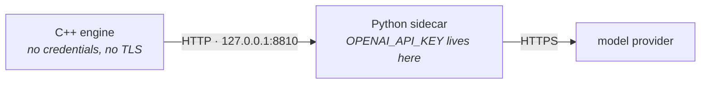
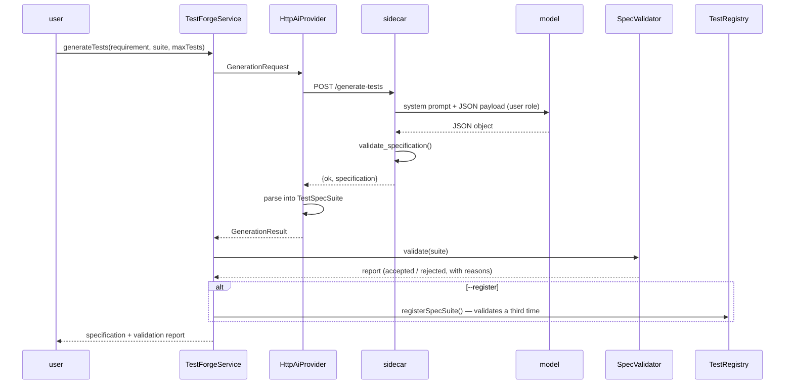
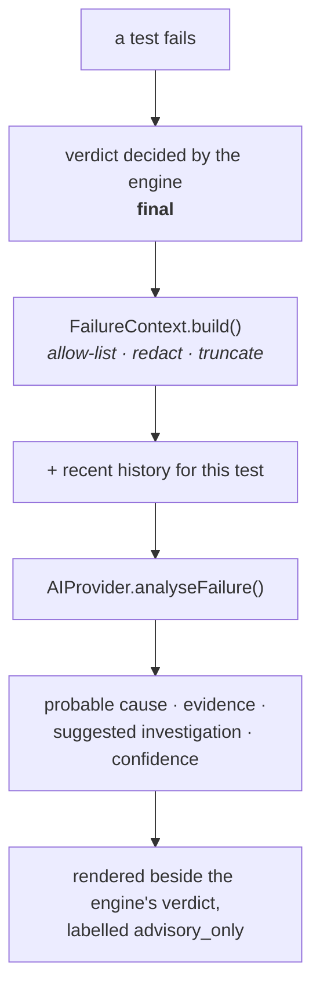

# AI architecture

Two AI features — test generation and failure analysis — built so that neither
can decide anything.

- [The principle](#the-principle)
- [Why a Python sidecar](#why-a-python-sidecar)
- [Test generation](#test-generation)
- [The specification model](#the-specification-model)
- [Validation](#validation)
- [Failure analysis](#failure-analysis)
- [The failure context](#the-failure-context)
- [Providers](#providers)
- [Evaluation](#evaluation)
- [Costs and limits](#costs-and-limits)
- [Running it](#running-it)

---

## The principle

> The AI proposes. The engine disposes.

Concretely:

| The model can | The model cannot |
|---|---|
| propose a test specification | write code, or cause code to be written |
| suggest a probable cause | change a pass into a fail, or a fail into a pass |
| suggest where to look next | reach anything except through a validated interface |
| suggest a failure category | assign one — its guess is recorded next to the engine's |

Both features are **off by default**. With `ai.enabled = false`, every AI path
returns a clearly labelled "disabled" result with instructions, rather than
failing or silently doing nothing.

```mermaid
flowchart LR
    subgraph Authoritative["Authoritative — C++"]
        A["assertions"] --> V["verdict: PASS / FAIL"]
        V --> R["TestResult"]
    end
    subgraph Advisory["Advisory — AI"]
        R -.evidence.-> M["model"]
        M -.explanation.-> O["analysis<br/><i>advisory_only: true</i>"]
    end
    O -.->|"displayed beside"| V
    O -x|"cannot alter"| V
```

---

## Why a Python sidecar

The C++ engine never contacts a model provider. It talks to a local Python
service over plain HTTP.



Three reasons, in order of weight:

**1. The credential exists in one process.** The engine cannot leak what it never
holds. Combined with `redactSecrets` on every log and report path, that gives two
independent barriers.

**2. The engine links no TLS stack.** `HttpClient` is a POSIX-socket
implementation with no OpenSSL dependency — see
[design-decisions.md](design-decisions.md). It cannot reach an `https` endpoint,
and the sidecar is the component that can.

**3. Prompts change far more often than a test runner.** Editing a prompt should
not mean recompiling C++. `python/ai/prompts.py` is a text file.

A fourth, smaller reason: the vendor SDK already implements retry, backoff and
rate-limit handling in Python. Reimplementing that in C++ would be work with no
payoff.

**The cost** is one more process for live AI. `MockAiProvider` makes the offline
path a first-class deterministic feature rather than a degraded one, so demos,
CI and unit tests never need the sidecar at all.

### The contract

```
GET  /health              -> {"ok", "ready", "key_present", "sdk_present", "reason"}
POST /generate-tests      <- {"requirement", "suite", "base_url", "max_tests"}
                          -> {"ok", "specification": {...}, "usage": {...}}
POST /analyze-failure     <- {"context", "test", "failure_category"}
                          -> {"ok", "analysis": {...}}
```

Both directions are validated on both sides.

---

## Test generation



```bash
testforge ai generate-tests --mock --register \
  --requirement "Users must have a unique username. Email is required.
                 Passwords need at least 8 characters."
```

The validation report is always returned, whether or not anything was
registered. A rejection has to be visible.

---

## The specification model

The whole vocabulary available to a generated test:

```json
{
  "suite": "generated",
  "requirement": "…",
  "tests": [
    {
      "name": "create_user_rejects_short_password",
      "description": "one sentence saying what this proves",
      "method": "POST",
      "endpoint": "/users",
      "headers": { "Accept": "application/json" },
      "body": { "username": "x", "password": "1234567" },
      "expected_status": 422,
      "max_response_time_ms": 2000,
      "assertions": [
        { "kind": "json_field_exists", "target": "detail" }
      ],
      "tags": ["generated"]
    }
  ]
}
```

Nine assertion kinds, and no others: `status_code`, `status_code_in`,
`response_time_under_ms`, `body_contains`, `body_not_contains`,
`json_field_exists`, `json_field_equals`, `header_exists`, `header_equals`.

**This is the security design.** `SpecTestCase` is a plain interpreter over
exactly these fields. There is no field for "run this command" and no mechanism
to add one at run time, so there is no path from model output to arbitrary
behaviour. The safety comes from the shape of the data type, not from asking the
model nicely.

---

## Validation

`SpecValidator` is the boundary. Full rule list in
[security.md](security.md#ai-output); the essentials:

- endpoints are **relative paths only** — a generated test cannot choose its
  target host;
- no `..`, no scheme, no `@`, no control characters;
- methods from an allow-list (no `TRACE`, no `CONNECT`);
- credential and routing headers rejected outright;
- names restricted to a safe character set and unique within the suite;
- size caps on body, headers and assertions;
- the resolved URL re-checked against `UrlPolicy`.

A test that violates a fatal rule is **dropped with a recorded reason**, never
repaired — repairing means running something nobody reviewed. One bad test does
not condemn the suite: the rest are still registered.

Validation happens three times, deliberately:

| Where | Purpose |
|---|---|
| `python/ai/schema.py` | Fails fast with a good message, so a bad generation is attributable to the model rather than to TestForge. |
| `SpecValidator` | **The security boundary.** This is the one that must be correct. |
| `registerSpecSuite` | Runs again immediately before registration, so a caller that skipped the second cannot register anything runnable. |

---

## Failure analysis



```
$ testforge ai analyze-failure --mock --run latest

Failure analysis
  test                  failure_injection.server_error
  engine verdict        FAILED / APPLICATION_FAILURE

AI analysis (advisory — the verdict above was decided by the test engine)
  probable cause    the endpoint returned HTTP 500 while the request itself
                    looked well-formed, which points at a server-side fault
  self-reported confidence 70%
  evidence
    - http_status = 500
    - response excerpt: {"detail":"deliberate server-side failure"}
  suggested investigation
    1. Inspect the service's exception log.
    2. Reproduce the request by hand and check whether it is input-dependent.
```

Three properties enforced in code:

- `AnalysisResult::toJson()` always sets `advisory_only: true` and a disclaimer;
- `TestForgeService::analyseResult` includes the engine's own verdict in the
  payload, under `decided_by: "testforge-engine"`, so no consumer can render one
  without the other;
- the model's category suggestion is recorded as `suggested_category` and never
  written to `TestResult::failureCategory`.

Confidence is **self-reported by the model** and displayed as such. A low
number is more useful than a confident wrong one.

---

## The failure context

`ai/FailureContext.cpp` builds the evidence package. Three concerns, handled
before anything leaves the process:

**Relevance.** A model reasons better over a small structured document than a
dump. Only fields that bear on the failure go in: status and category with its
meaning, the error message and detail, an allow-listed slice of metadata, the log
tail, and a distilled slice of diagnostics — only filesystems actually under
pressure, only the GPU summary rather than every field.

**Secrecy.** Result metadata passes an **allow-list of twelve keys**, so a field
added by a test tomorrow does not leak by default. Everything else goes through
`redactSecrets`. Request headers are dropped entirely rather than filtered.

**Size.** Per-field budgets — 40 log lines, 300 characters each, 4 KB of error
detail, 1.5 KB of response excerpt — plus a 24 KB total cap that trims the
largest optional sections if the sum still exceeds it. One enormous failure must
not produce an enormous bill.

The document declares itself:

```json
{
  "content_type": "testforge.failure_context",
  "trust_level": "untrusted_data",
  "test":   { "name": "...", "suite": "...", "tags": [...] },
  "result": { "status": "FAILED", "failure_category": "APPLICATION_FAILURE",
              "category_meaning": "The system under test errored internally...",
              "metadata": { "http_status": 500, ... },
              "log_tail": [...] },
  "diagnostics": { "os": {...}, "cpu": {...}, "memory": {...}, "gpu": {...} },
  "history": [ ... ],
  "run": { "run_totals": { "total": 59, "passed": 44, "failed": 3 } }
}
```

`run_totals` matters more than it looks: one red test among fifty green ones is
a different problem from fifty red ones, and the model cannot tell without it.
`history` is what separates "newly broken" from "always broken" from "flaky".

---

## Providers

`AIProvider` has three implementations.

| | When | Behaviour |
|---|---|---|
| `HttpAiProvider` | `ai.enabled = true` | Talks to the sidecar. Treats every response as untrusted: size-limited, parsed defensively, redacted, then validated. |
| `MockAiProvider` | `TESTFORGE_AI_MOCK=1` or `--mock` | Deterministic offline rules. Every output is labelled `MOCK`. |
| `DisabledAiProvider` | `ai.enabled = false` | Returns `ok: false` with a reason and a hint. A null object, so no call site needs a null check. |

`MockAiProvider` is not a toy. It reads the same structured evidence a real model
would and applies the obvious deterministic reading of it — a transport error
becomes `NETWORK_FAILURE`, a 5xx becomes `APPLICATION_FAILURE`. That makes the
whole pipeline — generation, validation, registration, execution, analysis,
reporting — testable and demonstrable with no key, no network and identical
output every time. Its generated specifications are asserted to pass the real
validator (`MockProvider.OutputPassesValidation`).

**The mock is never a fallback.** If the sidecar is unreachable, the right answer
is an error, not silently synthesised "AI" output. It is selected only by an
explicit flag or environment variable.

---

## Evaluation

AI output that nobody measures cannot be improved.

```bash
python -m python.evaluation.evaluate_generation --mock --testforge ./build/testforge
```

Four fixed requirement cases, scored on:

| Metric | What it means |
|---|---|
| `schema_validity` | Fraction of generations that parsed and passed the validator. The floor. |
| `test_validity` | Fraction of individual tests that survived. Distinguishes "10 tests, 1 bad" from "1 test, and it was bad". |
| `duplicate_rate` | Tests duplicating another by (method, endpoint, status). Duplication inflates the count without adding coverage. |
| `negative_ratio` | Tests expecting 4xx/5xx. A suite of only happy paths tests very little. |
| `requirement_coverage` | **Heuristic.** Keyword match against the behaviours a competent engineer would test. Detects "nothing mentions the password rule"; does *not* judge correctness. |
| `execution_pass_rate` | With `--run` and a live service: the fraction whose expectation actually held. The only metric here that reflects reality rather than shape. |

The harness imports the same validator the sidecar uses, so the score reflects
the real gate rather than a second opinion. It exits non-zero when schema
validity falls below 50%, so it can gate a prompt change in CI.

---

## Costs and limits

**Bounded by construction:** at most `ai.max_generated_tests` (25 by default) per
request; requirement text capped at 8,000 characters; failure context capped at
24 KB; responses capped at `ai.max_response_bytes`; a per-request timeout.

`temperature` is 0.2 — low enough that runs are comparable, not zero, because
exactly 0 tends to collapse into the same handful of test ideas.

**Honest limitations:**

- **Output is probabilistic.** The validator bounds what a generation can *do*,
  not whether it is *good*. A generated test can be valid and useless.
- **Coverage scoring is a keyword heuristic.** It catches an omitted rule; it
  cannot tell a correct test from a plausible-looking wrong one.
- **Prompt-injection mitigations are mitigations.** The controls are the
  validator and the closed interpreter. See
  [security.md](security.md#prompt-injection).
- **No live model is exercised in CI.** Non-deterministic and costs money per
  run. The contract, the validator and the failure paths are tested against the
  mock.
- **One provider.** The interface is provider-neutral, but only an
  OpenAI-compatible client is implemented. `OPENAI_BASE_URL` points it at any
  compatible endpoint, including a local model server.

---

## Running it

**Offline** — no key, no network, deterministic:

```bash
testforge ai generate-tests --mock --register "Users must have unique emails"
testforge run --suite generated
testforge ai analyze-failure --mock --run latest
```

**Live:**

```bash
export OPENAI_API_KEY=sk-...
scripts/run_ai_sidecar.sh              # or: docker compose --profile ai up

export TESTFORGE_AI_ENABLED=1
testforge ai status                    # confirms the sidecar and the key
testforge ai generate-tests --register "..."
```

`testforge ai status` with nothing running is deliberately informative rather
than a bare failure:

```
AI provider
  provider              http-sidecar
  enabled               yes
  endpoint              http://127.0.0.1:8810
  reachable             no
  error                 connect failed: Connection refused
  hint                  Start the sidecar with: uvicorn python.ai.service:app
                        --port 8810 (and export OPENAI_API_KEY for live calls)
```
