# Architecture

How TestForge is put together, and why the pieces sit where they do.

- [Layers](#layers)
- [The dependency rule](#the-dependency-rule)
- [Module map](#module-map)
- [Test execution flow](#test-execution-flow)
- [Parallel execution](#parallel-execution)
- [The failure triage pipeline](#the-failure-triage-pipeline)
- [Diagnostics](#diagnostics)
- [Persistence](#persistence)
- [The AI layer](#the-ai-layer)
- [Interfaces](#interfaces)
- [Object model](#object-model)
- [CI/CD](#cicd)

---

## Layers

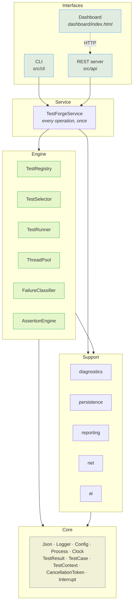

**Core** knows about nothing else. **Support** modules depend on core and on each
other only through interfaces. The **engine** depends on core and on the support
*interfaces*. The **service** wires concrete implementations together. The
**interfaces** layer is thin by design — `Commands.cpp` and `RestApiServer.cpp`
translate arguments and format output; neither contains logic the other lacks.

---

## The dependency rule

Every arrow below points *inwards*, towards the abstraction. Nothing in the
core knows the name of anything in the outer ring.

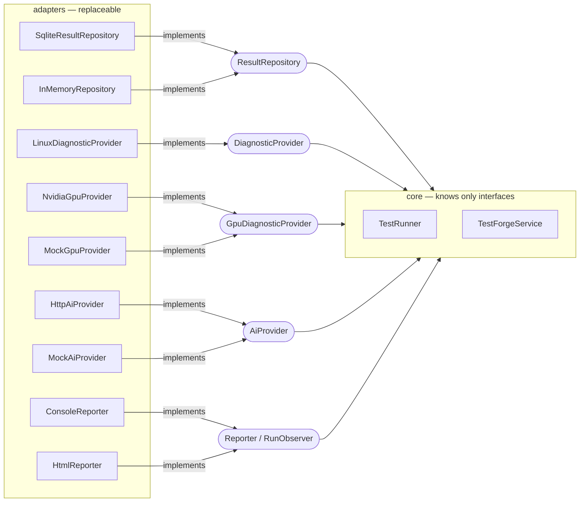

The engine depends on abstractions, never on the things that implement them:

| The engine uses | It never mentions |
|---|---|
| `ResultRepository` | SQLite |
| `DiagnosticProvider` | `/proc`, `nvidia-smi` |
| `AIProvider` | OpenAI, HTTP |
| `Reporter` | HTML, JUnit XML |
| `RunObserver` | the console |

This is not abstraction for its own sake — each of those interfaces has more
than one implementation *in this repository*, and the second implementation is
usually what makes the first testable:

- `InMemoryRepository` lets `tests/integration/RunnerTest.cpp` exercise the
  entire runner — retries, fail-fast, persistence ordering — with no database,
  no schema and no file system.
- `MockGpuProvider` lets the GPU reporting path be tested on a machine with no
  GPU, which is every machine in this project's CI.
- `MockAiProvider` lets the whole generate → validate → execute pipeline run
  offline and deterministically.

---

## Module map

| Module | Responsibility | Key types |
|---|---|---|
| `core` | Values and services with no policy | `json::Value`, `Logger`, `Config`, `ProcessRunner`, `TestResult`, `TestContext`, `CancellationToken`, `interrupt` |
| `testing` | Authoring and selecting tests | `AssertionEngine`, `TestRegistry`, `TestSelector`, `ApiClient`, `SpecTestCase` |
| `execution` | Running them | `ThreadPool`, `TestRunner`, `FailureClassifier` |
| `net` | HTTP in both directions | `HttpClient`, `HttpServer`, `UrlPolicy` |
| `diagnostics` | What the machine looked like | `LinuxDiagnosticProvider`, `NvidiaGpuProvider`, `DiagnosticCollector` |
| `persistence` | Where results go | `ResultRepository`, `SqliteResultRepository`, `db::Connection` |
| `reporting` | What humans and CI read | `ConsoleReporter`, `JsonReporter`, `HtmlReporter`, `JUnitReporter` |
| `ai` | Model integration, safely | `AIProvider`, `TestSpec`, `SpecValidator`, `FailureContext` |
| `api` | One entry point for both front ends | `TestForgeService`, `RestApiServer` |

---

## Test execution flow

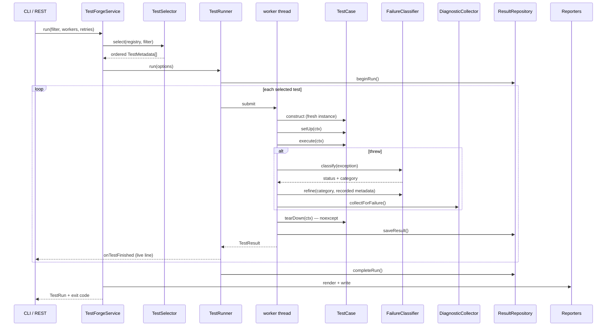

Three properties hold regardless of what the model returns:

- **Results are persisted as each test finishes**, not batched at the end. An
  interrupted run keeps what it already produced. `InMemoryRepository` counts the
  calls so a test can assert this.
- **`tearDown` is `noexcept`.** A throwing teardown would mask the original
  failure — the thing the engineer actually needs.
- **Tests are constructed per execution.** The registry holds factories, so a
  retry cannot inherit state from the attempt that failed and two workers can
  never share an instance.

---

## Parallel execution

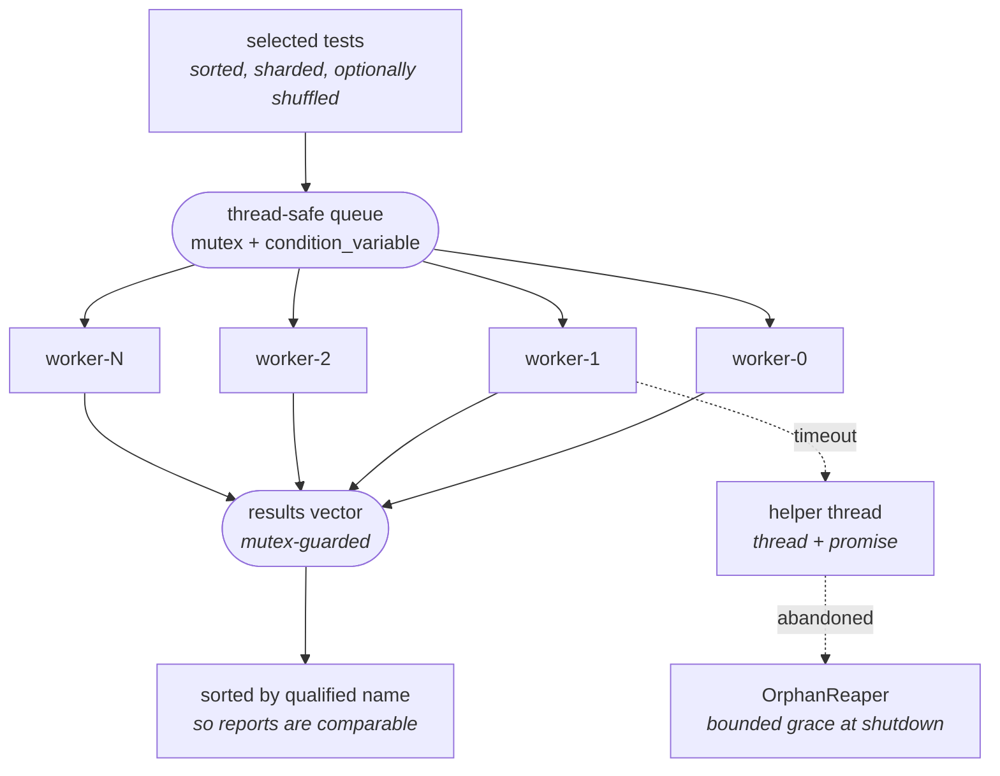

Completion order is nondeterministic; **report order is not**. Results are sorted
by qualified name before rendering, so two runs of the same suite produce
comparable output.

The full concurrency model, including what happens to an uncooperative test, is
in [concurrency.md](concurrency.md).

---

## The failure triage pipeline

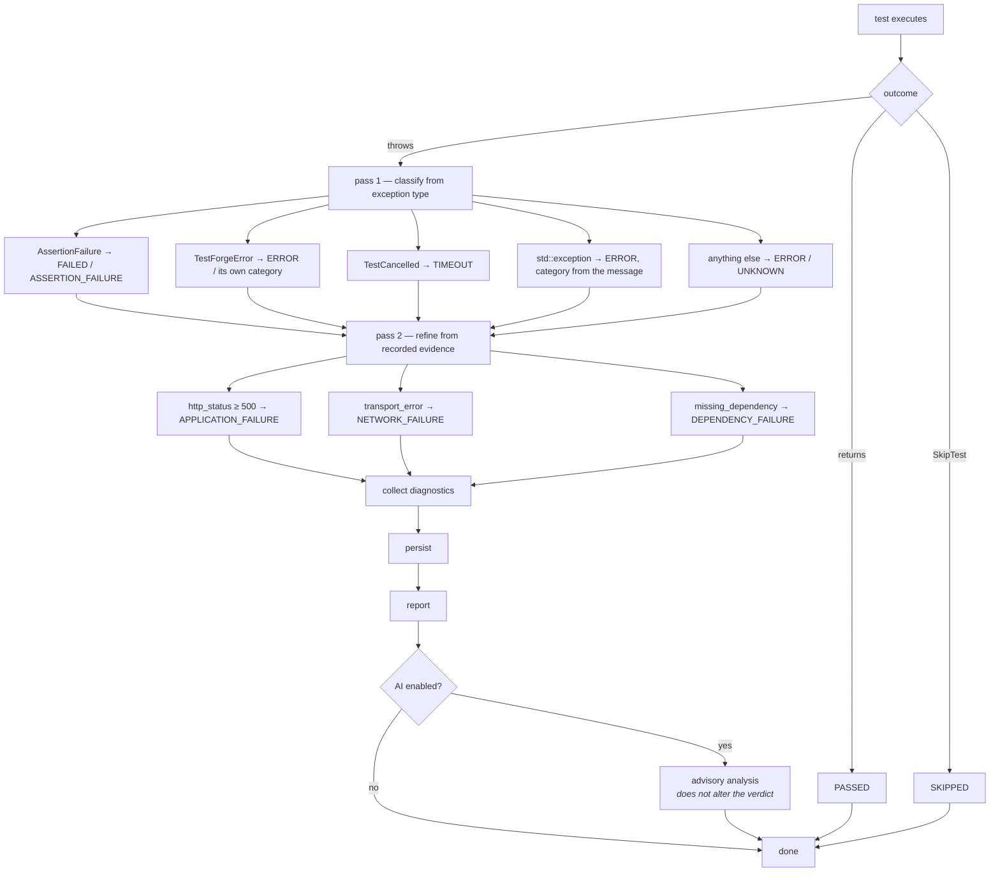

Refinement never makes a diagnosis vaguer. `FailureClassifier` ranks categories
by specificity and only promotes, so a `TIMEOUT` is not downgraded to a generic
application failure because the response happened to be a 500.

---

## Diagnostics

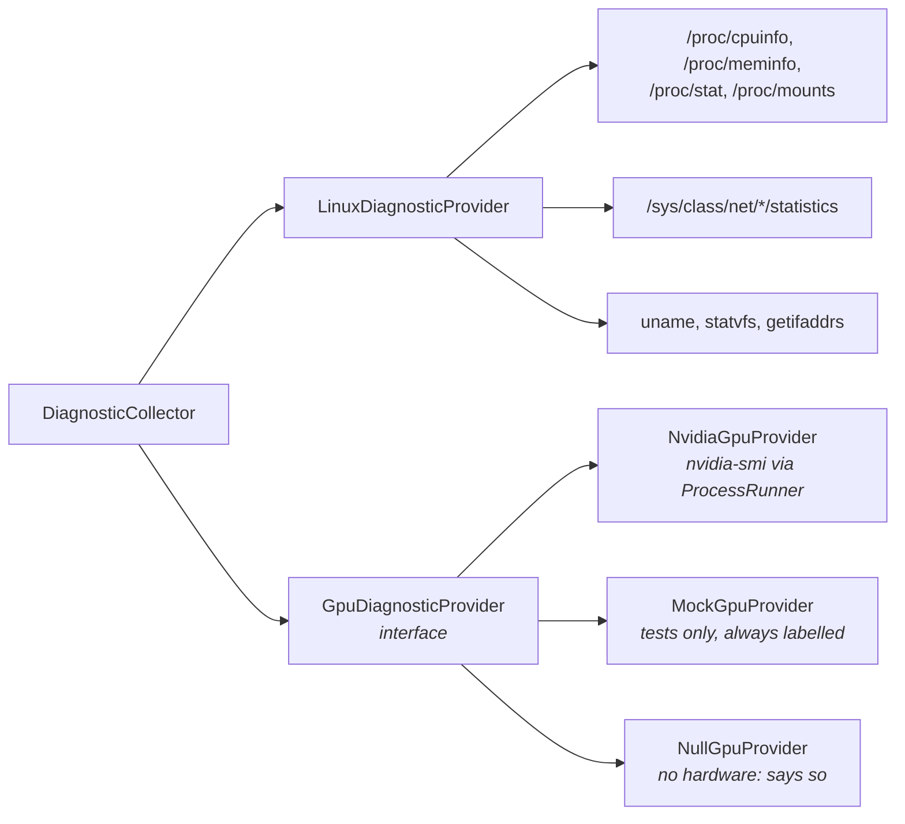

`createDefaultGpuProvider()` returns `NvidiaGpuProvider` when `nvidia-smi` is on
`PATH` and `NullGpuProvider` otherwise. It never returns the mock.

---

## Persistence

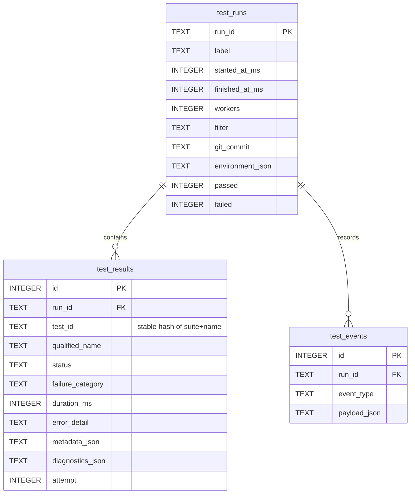

`test_id` is a deterministic hash of suite + name, so the same test carries the
same identity across runs and across machines — which is what makes history and
flake analysis possible at all. Details in [database.md](database.md).

---

## The Python sidecar

The only place C++ and Python meet is one HTTP hop on loopback. The boundary
exists because the C++ client links no TLS stack and so *cannot* reach
`api.openai.com` even if someone wanted it to.

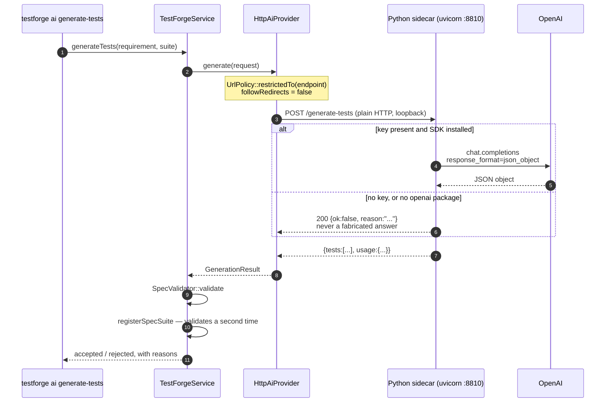

Three properties hold regardless of what the model returns:

1. **The sidecar never invents an answer.** No key, no SDK, or a non-JSON reply
   all produce an explicit failure, because a fabricated analysis is worse than
   none.
2. **The engine re-validates.** `registerSpecSuite` does not trust its caller —
   the same allow-list runs again at registration.
3. **A specification is data.** It becomes a `SpecTestCase` interpreting a
   closed enum, so there is nothing for a hostile specification to execute.

---

## The AI layer

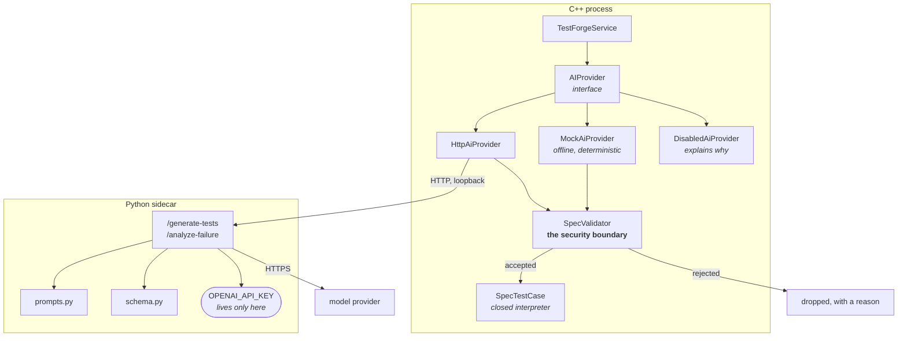

The boundary is `SpecValidator`, not the prompt. Prompt instructions are a
mitigation; the control is that a generated test can only express things
`SpecTestCase` already knows how to do. See [ai-architecture.md](ai-architecture.md)
and [security.md](security.md).

---

## Persistence flow

Where a result goes, and when. Persistence never blocks a verdict: a database
error is logged and the run continues, because the results are the product and
the database is a convenience.

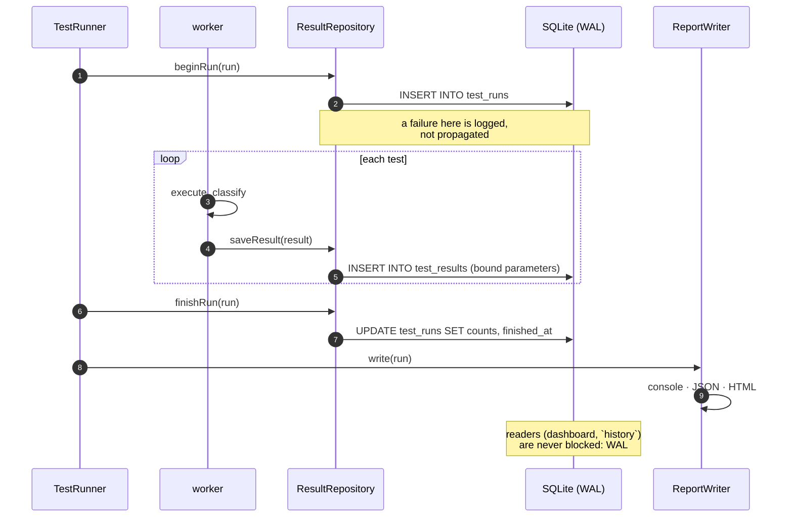

Reads take the same path in reverse: `historySummaries()` pulls the last 50
outcomes per test to compute flip rate and p95, and `listRuns()` reads stored
counts rather than re-loading every result row — a listing of 50 runs must not
load 50,000 results.

---

## Interfaces

| Interface | Implementations | What the second one buys |
|---|---|---|
| `TestCase` | `FunctionTestCase`, `ApiTestCase`, `SpecTestCase` | macro-authored, class-authored and generated tests share one runner |
| `ResultRepository` | `SqliteResultRepository`, `InMemoryRepository` | the runner is testable with no database |
| `DiagnosticProvider` | `LinuxDiagnosticProvider`, GPU providers | new sources without touching the runner |
| `GpuDiagnosticProvider` | `NvidiaGpuProvider`, `MockGpuProvider`, `NullGpuProvider` | GPU code paths testable with no GPU |
| `AIProvider` | `HttpAiProvider`, `MockAiProvider`, `DisabledAiProvider` | offline demos, CI, and graceful degradation |
| `Reporter` | console, JSON, HTML, JUnit | one run, four audiences |
| `RunObserver` | `ConsoleReporter` | live output without the runner knowing about a terminal |
| `LogSink` | console, file, memory | tests can capture and assert on logs |

---

## Object model

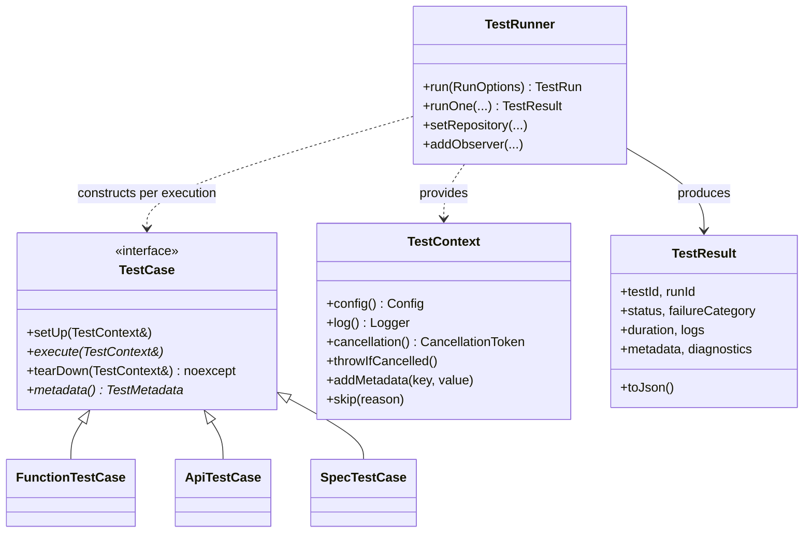

---

## CI/CD

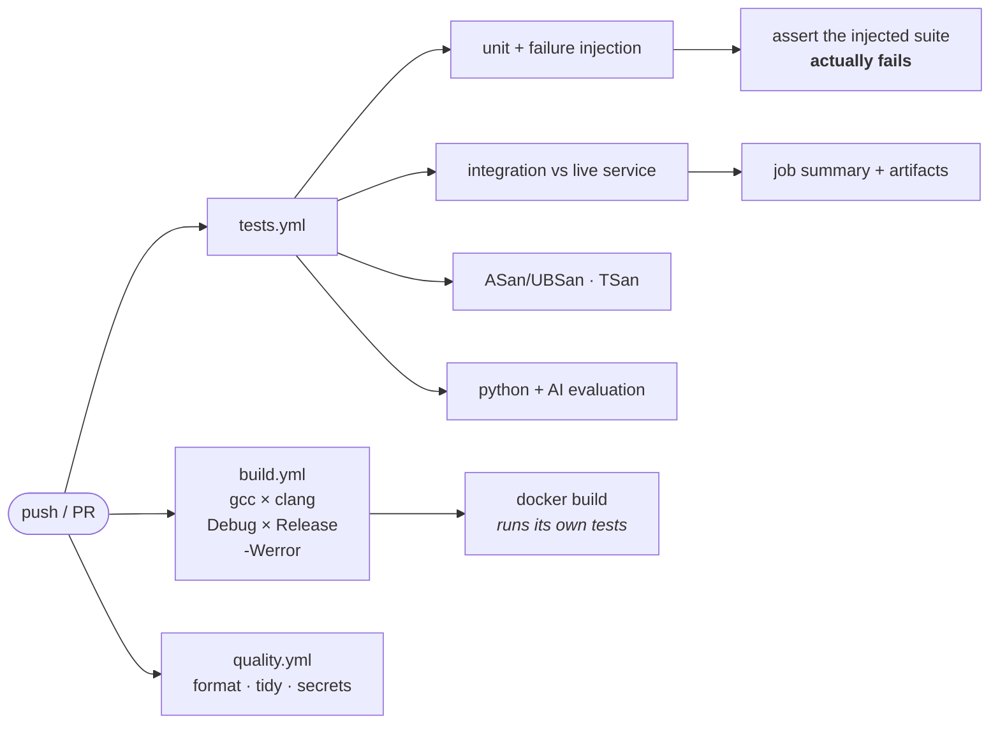

The `NEG` step is the unusual one: it asserts the *negative*. The
failure-injection suite must exit `1` and must produce the failure categories it
advertises. A test tool that stops detecting failures would otherwise pass CI
silently.
