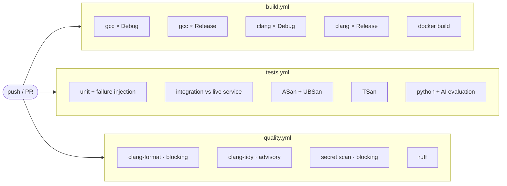

# CI/CD

Three workflows, and the one check that is unusual enough to explain.

- [Overview](#overview)
- [build.yml](#buildyml)
- [tests.yml](#testsyml)
- [quality.yml](#qualityyml)
- [Asserting the negative](#asserting-the-negative)
- [Caching](#caching)
- [Artifacts and summaries](#artifacts-and-summaries)
- [Running it locally](#running-it-locally)
- [Docker in CI](#docker-in-ci)
- [Using TestForge in your own pipeline](#using-testforge-in-your-own-pipeline)

---

## Overview



Everything runs on `ubuntu-22.04`, in parallel, with `concurrency` groups so a
new push supersedes an in-flight run for the same ref.

---

## build.yml

Four cells: **gcc-11 and clang-14 × Debug and Release**, all with
`-DTESTFORGE_WERROR=ON`.

That last flag is the point of the job. A warning that only one of the two
compilers emits still fails the build. The warning set is deliberately wide —
`-Wall -Wextra -Wpedantic -Wshadow -Wconversion -Wsign-conversion
-Wold-style-cast -Wnon-virtual-dtor -Wnull-dereference -Wuseless-cast`, plus the
GCC-only duplication checks. Warnings live on an INTERFACE target
(`TestForge::warnings`), so vendored SQLite is not held to a standard we cannot
fix on its behalf.

`fail-fast: false` — one failing cell should not hide the other three.

Each cell also smoke-checks the binary it produced:

```bash
./build/testforge --version
./build/testforge list --suite smoke
./build/testforge run --suite smoke --no-db --no-report
```

The Release/gcc cell uploads `testforge` and `testforge_bench` as artifacts.

---

## tests.yml

### `unit`

Builds and runs the whole GoogleTest suite through CTest, then performs the
negative check described [below](#asserting-the-negative).

### `integration`

Starts the sample FastAPI service, waits for `/health` by **polling rather than
sleeping** — a fixed sleep is either too short on a slow runner or wasted time on
a fast one — then runs the API suite against it over real HTTP, followed by
everything except the deliberate failures.

On completion it writes a Markdown summary to the workflow page and uploads the
reports. On failure it also uploads the service log, because "the tests failed"
and "the service never started" look identical from the test side otherwise.

### `sanitizers`

A matrix of `asan-ubsan` and `tsan` — separate cells because ASan and TSan
cannot be combined (CMake fails configuration with an explanation rather than
letting the linker produce something confusing).

```yaml
env:
  ASAN_OPTIONS: detect_leaks=1:halt_on_error=1:abort_on_error=1
  UBSAN_OPTIONS: print_stacktrace=1:halt_on_error=1
  TSAN_OPTIONS: halt_on_error=1:second_deadlock_stack=1
```

`halt_on_error` keeps the first report from being buried under the cascade that
usually follows it. TSan is the job that would catch a missing lock the
concurrency tests happen not to provoke.

### `python`

The sample service's own pytest suite, `ruff`, and the AI evaluation harness in
`--mock` mode — no API key in CI, so the deterministic provider exercises the
whole generate → validate → score path with stable numbers.

---

## quality.yml

| Job | Blocking? | Why |
|---|---|---|
| `clang-format` | **yes** | Formatting is mechanical. A diff means someone skipped a step, not that they made a judgement call. |
| `clang-tidy` | no | On a checkout this size it produces enough findings that treating each as fatal would teach people to ignore it. Reported in the log and the job summary. |
| `secrets` | **yes** | A committed key is not a style question. |
| `ruff` | **yes** | Same reasoning as clang-format. |

**The lint jobs are version-pinned on purpose.** `pip install ruff` with no
constraint, and `ruff check` with no configuration file, together make the
result a property of the day it ran: ruff's default rule set has grown over
releases, so an untouched repository goes from green to red because someone
else shipped a version. This was not hypothetical here — the same checkout
produced 1 finding under ruff 0.12 and 113 under ruff 0.16. Both are now
closed: `pyproject.toml` fixes `target-version` and an explicit `select` list,
and the workflow installs the same `ruff>=0.4,<0.13` range as
`python/requirements.txt`. Verified clean under both 0.12.12 and 0.16.7.

The clang-tidy job strips the vendored SQLite amalgamation out of
`compile_commands.json` before running — analysing third-party C we are not
going to fix would bury our own findings.

The secret scan matches credential *shapes* (`sk-…`, `ghp_…`, `xoxb-…`,
`AKIA…`, PEM headers), skipping `.env.example`, which is a template of empty
keys. It also fails if `.env` is tracked by git.

TestForge's own redaction tests have to contain secret-shaped fixtures, so the
scan supports a per-occurrence exemption: a `NOT-A-SECRET` marker on the
matching line or the line directly above it. The exemption is per line rather
than per directory, because excluding `tests/` would also hide a real key
committed in a test, and the job prints how many exemptions exist so that an
unexplained increase is visible in review.

The checks that must never regress are enforced by the **compiler** with
`-Werror` in `build.yml`, not by clang-tidy. That is the right split: a
mandatory rule belongs where it cannot be skipped.

---

## Asserting the negative

This is the unusual check, and the one most worth copying.

TestForge's job is to detect failures. A regression that made it stop detecting
them would turn CI **greener**, and nobody would notice. So CI asserts the
negative: the failure-injection suite must *fail*, with the right exit code and
the right categories.

```yaml
- name: Verify the failure-injection suite actually fails
  run: |
    set +e
    ./build/testforge run --suite failure_injection --json --no-report > /tmp/injected.json
    code=$?
    set -e
    if [ "$code" != "1" ]; then
      echo "expected exit code 1 (tests failed), got $code"
      exit 1
    fi
    python3 - <<'PY'
    import json, sys
    run = json.load(open("/tmp/injected.json"))
    seen = {r["failure_category"] for r in run["results"]}
    required = {"ASSERTION_FAILURE", "TIMEOUT", "NETWORK_FAILURE",
                "DEPENDENCY_FAILURE", "ENVIRONMENT_FAILURE",
                "RESOURCE_FAILURE", "CONFIGURATION_FAILURE"}
    missing = required - seen
    if missing:
        print("failure-injection suite did not produce:", sorted(missing))
        sys.exit(1)
    print("classified categories:", sorted(seen))
    PY
```

Two things are checked: the **exit code** must be exactly `1` (tests failed) —
not `0`, and not `3`, which would mean TestForge itself broke — and the run must
produce every failure category it advertises.

---

## Caching

`FetchContent` downloads GoogleTest and the SQLite amalgamation into
`.deps-cache/`. Every job caches it:

```yaml
- uses: actions/cache@v4
  with:
    path: .deps-cache
    key: deps-${{ runner.os }}-${{ hashFiles('cmake/Dependencies.cmake') }}
```

Keying on the hash of `Dependencies.cmake` means a version bump invalidates the
cache automatically and nothing else does. This turns a ~40 s step into a few
seconds and removes a dependency on sqlite.org being reachable from the runner.

---

## Artifacts and summaries

A red run should explain itself on the workflow page, not only inside a log:

```bash
python -m python.tools.summarize_reports 'reports/*.json' --github-summary
```

produces a table of totals, a failure-category breakdown, and collapsible detail
per failing test, appended to `$GITHUB_STEP_SUMMARY`. It also merges several
report files, which is what a sharded run produces.

| Artifact | Retention |
|---|---|
| `testforge-reports` — JSON and HTML | 14 days |
| `testforge-linux-x86_64` — binaries | 14 days |
| `ai-evaluation` — generation scores | 14 days |
| `sample-service-log` — on failure only | default |

For native CI integration, `reporting.junit = true` emits JUnit XML that GitHub,
Jenkins and GitLab all render natively.

---

## Running it locally

```bash
scripts/build.sh --werror                 # what build.yml does
ctest --test-dir build --output-on-failure

scripts/build.sh --asan
ctest --test-dir build-asan --output-on-failure

scripts/build.sh --tsan
ctest --test-dir build-tsan --output-on-failure

scripts/format.sh --check                 # what quality.yml does
pytest sample-service/tests -q
python -m python.evaluation.evaluate_generation --mock --testforge ./build/testforge
```

`scripts/demo.sh` covers the integration path end to end.

---

## Docker in CI

`build.yml` builds both images from scratch. The engine image **runs the
test-suite as part of its own build**:

```dockerfile
RUN if [ "${BUILD_TESTS}" = "ON" ]; then ctest --test-dir build --output-on-failure; fi
```

An image that cannot pass its own tests is never produced. It also doubles as a
from-scratch verification: no cached CMake state, no cached dependencies, a
clean Ubuntu base.

---

## Using TestForge in your own pipeline

Exit codes are the contract:

```yaml
- name: Run tests
  run: testforge run --suite regression --workers 4 --report-dir reports
  # 0 passed · 1 tests failed · 2 bad usage · 3 TestForge broke
  # 130/143 interrupted before finishing — never treat as a pass
```

Sharding across a matrix:

```yaml
strategy:
  matrix:
    shard: [0, 1, 2, 3]
steps:
  - run: testforge run --shards 4 --shard ${{ matrix.shard }} --report-dir reports
  - uses: actions/upload-artifact@v4
    with: { name: reports-${{ matrix.shard }}, path: reports/ }
```

Sharding is by a hash of the stable test id, so adding a test does not reshuffle
the others between shards, and each shard is reproducible.

Merge afterwards:

```yaml
- run: python -m python.tools.summarize_reports 'reports-*/*.json' --github-summary --fail-on-failures
```

For flake triage, `--retry-failed 1` re-runs only *transient* categories
(network, timeout, resource) and marks anything that passes on a retry as a
flaky candidate. Assertion failures are never retried — a deterministic bug does
not un-break itself, and retrying it hides the signal.
