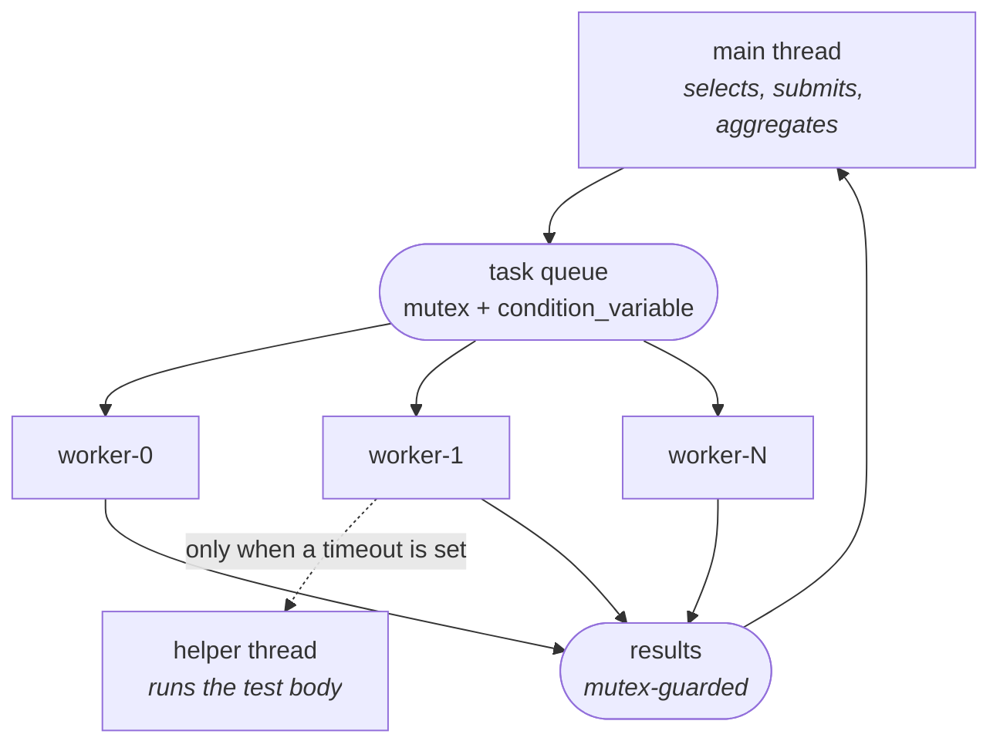
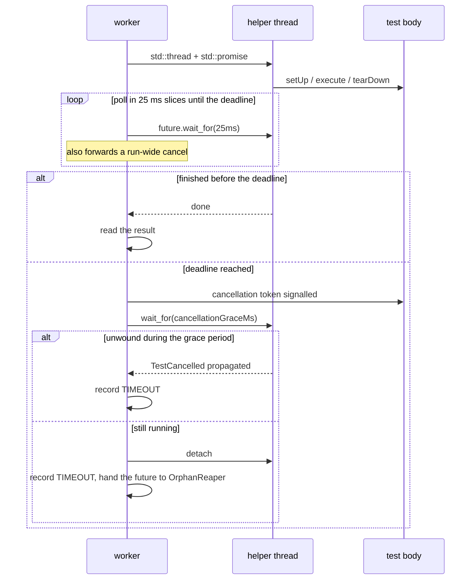

# Concurrency

The threading model, the synchronisation, and — most importantly — what is *not*
guaranteed.

- [The model](#the-model)
- [The thread pool](#the-thread-pool)
- [Timeouts](#timeouts)
- [Orphaned tests](#orphaned-tests)
- [Shared state](#shared-state)
- [Cancellation](#cancellation)
- [Signals](#signals)
- [Determinism](#determinism)
- [What is verified](#what-is-verified)
- [Limitations](#limitations)

---

## The model



One rule underpins all of it: **a test runs on exactly one thread**. That is what
makes thread-local log capture and thread-local soft-assertion scopes correct,
and it is why per-test log tails never interleave even when eight tests run at
once.

---

## The thread pool

`include/testforge/execution/ThreadPool.hpp`

- N workers created in the constructor, joined in the destructor.
- One `std::mutex` guards the queue, the pending count and the stopping flag.
- `std::condition_variable workAvailable_` parks idle workers so they consume no
  CPU; `idle_` wakes `waitIdle()` when the last task completes.
- `submit()` returns a `std::future`, so a caller can wait on one specific task.
- A task that throws does **not** kill its worker: `std::packaged_task` captures
  the exception into the future. A catch-all around the invocation is a
  backstop — an escaping exception would call `std::terminate` and take the
  whole run down.

### Shutdown has two modes

| | `shutdown()` | `shutdownNow()` |
|---|---|---|
| Queued tasks | run to completion | **discarded, never run** |
| Running task | waited for | waited for |
| Threads | joined | joined |
| Futures of discarded tasks | n/a | `future_error(broken_promise)` |

The destructor calls `shutdown()`. Silently discarding queued tests would lose
results, which is worse than waiting.

**Discarding is the subtle one**, and it is subtle for a reason that is easy to
miss: `pending_` is what `waitIdle()` blocks on, so a dropped task must still be
*accounted for*. Forget the decrement and `waitIdle()` does not return a wrong
answer — it hangs forever. The worker that observes the discard flag drains the
queue and decrements once per dropped task before it exits:

```cpp
if (stopping_.load(std::memory_order_acquire) && discardQueued_) {
    while (!tasks_.empty()) {
        tasks_.pop();
        --pending_;      // or waitIdle() never wakes
    }
    idle_.notify_all();
    return;
}
```

A discarded task's `packaged_task` is destroyed unrun, so anyone holding its
future gets `std::future_error(broken_promise)` rather than a value or a wait
that never ends. `ThreadPool.FuturesOfDiscardedTasksReportABrokenPromise` pins
that.

**Both are safe to call twice, and safe to call concurrently.** They used not to
be. `joinAll()` iterated `workers_` and then cleared it with no lock, so two
threads calling `shutdown()` at the same time would both `join()` the same
`std::thread` — undefined — while one mutated the vector the other was walking.
It now takes a dedicated `joinMutex_` (not the queue mutex: the workers being
joined need *that* to finish their last task, so joining under it would
deadlock) and is idempotent via a `joined_` flag. `workers_` is no longer
cleared at all, which has a second benefit: the vector is written once, in the
constructor, so `workerCount()` became a race-free read.

```cpp
{
    ThreadPool pool(4, "worker");
    auto future = pool.submit([] { return 42; });
    // ... destructor drains and joins
}
```

Worker identity is thread-local (`ThreadPool::currentWorkerName()`) and lands on
every `TestResult`, which matters when a failure only reproduces under
contention.

---

## Timeouts

This is the most intricate part of the runner, and the behaviour is easier to
reason about once the trade-off is explicit.

**TestForge never forcibly terminates a thread.** `pthread_cancel` and its
relatives leave mutexes locked, destructors unrun and the allocator in an
unknown state. Every verdict the process reports afterwards becomes suspect. For
a tool whose entire product is trustworthy verdicts, that trade is not worth
making.

So a timed-out test is *asked* to stop:



A test cooperates in three ways:

```cpp
ctx.throwIfCancelled();               // between logical steps
ctx.sleepFor(Milliseconds{100});      // instead of std::this_thread::sleep_for
api.get("/slow");                     // the HTTP client honours the token
```

A cooperative test unwinds in milliseconds. The `failure_injection` suite
contains one of each — `cooperative_timeout` stops almost immediately;
`uncooperative_timeout` uses `std::this_thread::sleep_for` and is abandoned.

**Finishing during the grace period is still a timeout.** The grace exists for a
cancelled test to unwind, not for an uncooperative one to succeed late. A test
that ignored cancellation and completed after its deadline was racing a deadline
it had already lost, so its verdict is not trustworthy and the result is
`TIMEOUT` either way. (This was a real bug during development: an early version
reported such a test as `PASSED`.
`RunnerFixture.FinishingInsideTheGracePeriodIsStillATimeout` exists to keep it
fixed.)

---

## Orphaned tests

An abandoned thread is still running, and it is still writing to the test's
object, its context and its result. If those lived on the worker's stack, the
stray thread would write into freed memory the moment `runOne()` returned.

They do not. They live in a heap-allocated bundle:

```cpp
struct BodyExecution {
    TestMetadata metadata;                  // an owned copy
    TestCasePtr test;
    std::unique_ptr<TestContext> context;
    TestResult result;
    std::vector<std::string> logs;
};

auto execution = std::make_shared<BodyExecution>();

auto finishedPromise = std::make_shared<std::promise<void>>();
std::future<void> body = finishedPromise->get_future();
std::thread bodyThread([execution, finishedPromise] {
    executeBody(*execution);
    finishedPromise->set_value();
});
```

Both the worker and the helper thread hold the `shared_ptr`. The stray thread
writes into memory it legitimately owns, and the bundle is freed when the last
of the two lets go. The metadata is an owned *copy* for the same reason: the
caller's copy lives in a lambda that is destroyed when the task completes.

When the deadline passes, the worker reads **nothing** from the bundle — the
other thread may be mid-write — and reports what it knows from outside:

```
TIMEOUT  failure_injection.uncooperative_timeout
  test exceeded its 400ms deadline and only finished during the
  cancellation grace period
  The test did not observe cancellation... Add a ctx.throwIfCancelled()
  checkpoint, or use ctx.sleepFor() instead of std::this_thread::sleep_for.
```

`OrphanReaper` keeps a completion future for each stray. At `TestRunner`
destruction it waits a bounded grace period, then logs the names of anything
still running:

```
WARN [runner] tests ignored cancellation and are still running at shutdown
     count=1 tests=failure_injection.uncooperative_timeout
```

**Nothing is leaked to achieve this.** The helper thread is a `std::thread`
signalling a `std::promise`, not a `std::async` task, and it is `detach`ed at
the point of abandonment. That combination matters: a future obtained from
`std::async` *blocks in its own destructor* until the task completes, so
abandoning one would either hang shutdown on the very test that is already
misbehaving, or have to be leaked to avoid it. A promise-backed future has no
such destructor, and a detached thread's stack is reclaimed by the runtime when
it eventually exits. LeakSanitizer confirms the difference — it flagged the
earlier `std::async` design and is clean on this one.

---

## The use-after-free

Worth its own section, because it is the bug this design was already *trying*
to prevent and still got wrong.

`TestContext` hands a test everything it may reach. For efficiency it holds
non-owning pointers rather than copies:

```cpp
const Config* config_;
const TestMetadata* metadata_;
```

The `BodyExecution` bundle exists precisely so those pointers stay valid for an
abandoned thread — the metadata is an owned copy inside the bundle, and the
bundle is co-owned by the worker and the body thread. That reasoning was
applied to the metadata and **not** to the Config, which belongs to whoever
called `TestRunner`, not to the runner:

```cpp
execution->context = std::make_unique<TestContext>(
    impl_->config, ...);   // a reference into the caller's storage
```

So the failing sequence was:

1. a test blows its deadline and ignores cancellation,
2. the runner records `TIMEOUT` and detaches the thread,
3. `~TestRunner` reaps for a bounded grace period, then gives up,
4. the **caller's Config is destroyed**,
5. the still-running body calls `ctx.config()`.

**How it was found.** Not by a sanitizer run — the suite was green under ASan,
because the strays happened to finish in time or never touched the Config. It
came out of reading the two lifetimes side by side and asking what the bundle
did *not* cover.

**How it was confirmed.** By writing the regression test first, then reverting
the fix and rebuilding the same ASan binary with only that one line changed:

```
WITH the fix:     [  PASSED  ] 1 test.
WITHOUT the fix:  ERROR: AddressSanitizer: heap-use-after-free
  READ  #3 json::Value::find   #4 RunnerTest.cpp (the orphan reading ctx.config())
        #11 TestRunner.cpp (the detached body thread)
  freed by thread T0  #4 RunnerTest.cpp (ownedConfig.reset())
```

The test was watched failing before it was allowed to pass.

**The fix** is one line of intent: the Config joins the bundle as an owned copy,
alongside the metadata that was already there for the same reason.

```cpp
struct BodyExecution {
    Config config;          // owned copy: TestContext holds a pointer to it
    TestMetadata metadata;  // owned copy: the caller's may not outlive us
    ...
};
```

The test deliberately heap-allocates the Config so that reading it after the
free is a plain `heap-use-after-free`, which ASan always reports — a stack
object would have needed `detect_stack_use_after_return`.

---

## Shared state

| State | Protection | Note |
|---|---|---|
| Task queue | `std::mutex` + `condition_variable` | one lock for queue, pending count and stop flag |
| `TestRegistry` | `std::mutex` | factories are copied out before being invoked, so user code never runs under the lock |
| Results vector | `std::mutex` | held only for the `push_back` |
| `LogManager` sinks | `std::mutex` | the list is copied, then written outside the lock — a slow sink must not block other threads, and holding a lock across a virtual call invites deadlock |
| Log capture | `thread_local` | no lock at all; correct because a test is one thread |
| Soft assertions | `thread_local` | same reasoning |
| Assertion counter | `std::atomic<uint64_t>` | relaxed ordering; it is a statistic |
| Cancellation | `std::atomic<bool>` + mutex for the reason | release/acquire pairing so a thread that sees the flag also sees the reason |
| SQLite | `std::mutex` in the repository | serialised mode plus one lock; a write is microseconds against a test's milliseconds |
| Worker name | `thread_local` | set once when the worker starts |

**`TestRegistry` copies the factory before calling it:**

```cpp
TestFactory factory;
{
    const std::lock_guard<std::mutex> lock(mutex_);
    factory = found->second.factory;
}
return factory ? factory() : nullptr;   // user code, outside the lock
```

A factory is user code. It may take arbitrarily long, and it may itself touch
the registry.

---

## Cancellation

`CancellationSource` is the writable side; tests only ever see a read-only
`CancellationToken`.

```cpp
CancellationSource source;
CancellationToken token = source.token();

source.cancel("deadline exceeded");   // idempotent: the first reason wins
token.isCancelled();                  // acquire
token.reason();
token.waitFor(Milliseconds{100});     // false if cancelled early
```

Two details that matter:

**The first reason wins.** A later blanket "run aborted" must not overwrite the
specific "deadline of 500ms exceeded" — the specific one is what a human needs.

**The state outlives the source.** Both sides hold a `shared_ptr`, so a token
captured by a still-running test remains valid after the source is destroyed.

`waitFor` uses `condition_variable::wait_for` with a predicate, which handles
spurious wake-ups and means a cancelled sleep returns immediately rather than
after its full duration.

---

## Signals

A signal handler may do almost nothing safely: no allocation, no locking, no
logging. It runs on whatever thread the kernel picked, possibly in the middle
of `malloc`. So `testforge::interrupt` does the one safe thing — it sets an
atomic — and the code that can block for a noticeable time polls it.

```cpp
// installed once, in main()
interrupt::installHandlers();          // SIGINT, SIGTERM; SIGPIPE ignored

// serve: poll instead of blocking outright
while (!interrupt::requested()) {
    if (server.waitFor(Milliseconds{200})) { return kSuccess; }
}
server.stop();

// run: the run owns this thread, so a watcher polls on its behalf
std::thread watcher([&] {
    while (!runFinished.load(std::memory_order_acquire)) {
        if (interrupt::requested()) {
            service.requestCancellation("interrupted by signal");
            return;
        }
        std::this_thread::sleep_for(std::chrono::milliseconds(100));
    }
});
```

Polling is not laziness. A `condition_variable` wait is **not** woken by a
signal, so `server.wait()` could never return no matter how many times you
pressed Ctrl-C. 200 ms is imperceptible to a person and free to a machine.

**How it reaches a test that is already running.** The run-level source is
not enough on its own. A test with no timeout runs *inline on the worker
thread*, so nothing is polling the run source on its behalf and it would never
observe a Ctrl-C at all. Each executing test therefore publishes its
`CancellationSource` in a mutex-guarded registry on the runner, and
`requestCancellation()` signals every entry directly. Registration is scoped by
an RAII guard declared after the source it names, so deregistration always
happens while the object is still alive, under the same mutex the canceller
holds.

That also removes the up-to-25ms forwarding lag on the timed path. The polling
loop still forwards the run source as a backstop, because fail-fast cancels
only the run source.

**What cancellation means here.** Stop starting new work — not abort. Results
already collected are kept, persisted and reported; tests that never started
are recorded as skipped with the reason; the test that was in flight is
recorded as skipped too, because a cancellation-aware sleep returning early
makes whatever the body concluded afterwards an artefact of the cancellation
rather than a property of the code. The run then exits `128 + signal`.

Three defects were stacked here, each hidden by the one in front of it:

1. The handlers were installed and the flag was **never read anywhere**. That
   is worse than installing nothing: replacing SIGINT's default disposition
   without honouring it means Ctrl-C stops working entirely. `testforge serve`
   could not be stopped by Ctrl-C, by SIGTERM, or by `docker stop`.
2. Once the flag was honoured, cancellation surfaced as *test failures* — the
   sleeping tests failed the assertion that followed their interrupted sleep.
   Pressing Ctrl-C told you your code was broken.
3. Once those were skips rather than failures, nothing failed, so the run
   reported `RESULT: PASS` and exit `0`. An interrupted run claimed success for
   tests it never executed.

---

## Determinism

Concurrency makes completion order nondeterministic. Several things are kept
deterministic anyway:

| | |
|---|---|
| Selection order | sorted by qualified name before sharding or shuffling |
| Report order | results re-sorted by qualified name after the run |
| Sharding | by a hash of the test id, so adding a test does not reshuffle the others between shards |
| Shuffling | seeded; the seed is reported so a failing order can be replayed |
| JSON output | objects preserve insertion order, so reports are diffable |

---

## What is verified

| Property | Where |
|---|---|
| Every submitted task runs exactly once | `ThreadPool.RunsEveryTaskExactlyOnce` — checks the sum, not just the count, so a double-run is caught |
| A throwing task does not kill its worker | `ThreadPool.ExceptionsTravelInTheFutureAndDoNotKillTheWorker` — one worker, so a dead worker deadlocks |
| All workers are actually used | `ThreadPool.UsesAllItsWorkers` — a barrier that cannot be satisfied sequentially |
| Concurrent submission is safe | `ThreadPool.ConcurrentSubmissionIsSafe` — 8 threads × 50 tasks |
| Cancellation wakes a sleeper immediately | `Cancellation.WaitForWakesImmediatelyOnCancel` |
| A token outlives its source | `Cancellation.TokenOutlivesItsSource` |
| Parallel is faster than sequential | `RunnerFixture.ParallelIsFasterThanSequentialForSleepingTests` |
| Report order is stable | `RunnerFixture.ResultsAreOrderedDeterministicallyRegardlessOfCompletion` |
| An uncooperative test is reported | `RunnerFixture.AnUncooperativeTestIsStillReportedAsTimedOut` |
| Late completion is still a timeout | `RunnerFixture.FinishingInsideTheGracePeriodIsStillATimeout` |
| Concurrent DB writes are serialised | `Repository.ConcurrentWritesAreSerialised` — 4 threads × 25 rows |

The whole suite also runs under **ThreadSanitizer** and under
**AddressSanitizer + UndefinedBehaviorSanitizer** (with leak detection) in CI.
Both are clean across all 395 tests.

That is not a formality — TSan found a real bug that none of the tests above
caught. `HttpServer::stop()` used to close the listening socket *before*
joining the acceptor thread, so the acceptor could `poll()` or `accept()` on a
descriptor the stopping thread had already closed; on a busy process that
number could by then refer to a different file. The fix was to join first and
close afterwards, which costs up to 200 ms on shutdown and makes the descriptor
owned by exactly one thread at a time.

**How ThreadSanitizer was actually used.** Not as a box to tick. The first run
produced seven "double lock of a mutex" reports, all in the cancellation path.
The tempting responses were to ignore TSan entirely or to blanket-suppress the
file; both would have been wrong. Reading the full report showed the mutex was
"created at" a `lock()` call, which is impossible unless TSan never saw an
init — and libstdc++ on Linux initialises `std::mutex` statically with
`PTHREAD_MUTEX_INITIALIZER`, so there is no `pthread_mutex_init` to observe.
That diagnosis justified two suppressions *by function name*, and with the noise
gone TSan immediately reported two genuine races in `HttpServer::stop()` that
had been buried underneath. Narrowing the suppression is what found the bug.

TSan also emits "double lock of a mutex" against `CancellationSource::cancel`.
That one is a false positive caused by libstdc++'s `constexpr`-initialised
`std::mutex` (no `pthread_mutex_init` for TSan to observe) combined with
`condition_variable`'s internal unlock/relock. It is suppressed by name in
`.tsan-suppressions`, with the full reasoning recorded there. Data races are
never suppressed — and suppressing the mutex noise is exactly what made the
`HttpServer` race visible.

```bash
scripts/build.sh --tsan
export TSAN_OPTIONS="suppressions=$PWD/.tsan-suppressions"
ctest --test-dir build-tsan --output-on-failure
```

---

## Limitations

**An uncooperative test occupies a thread** until the process exits. This is the
deliberate consequence of refusing to kill threads. It is not a memory leak —
the thread is detached and its stack is reclaimed when it finally returns, which
LeakSanitizer confirms — but it *is* a thread and a core that the rest of the
run cannot use, and if the test never returns, neither does the resource.
Mitigations: the result says so, the runner names it at shutdown, and the fix is
documented in the failure message. A test that must be interruptible has to be
written that way.

**No global concurrency limit across processes.** Two `testforge` processes each
with `--workers 8` will use 16 workers. Sharding is the intended answer for
parallel CI.

**The run is single-machine.** `--shards N --shard I` lets a CI matrix run N
independent copies, but nothing coordinates them.

**Test isolation is not enforced.** Tests share a process, so one can affect
another through global state, the file system, or the system under test.
TestForge gives each test a fresh instance, its own context and its own log
capture; it cannot stop a test from writing to a shared file. Use
`--shuffle --seed` to surface order dependencies.

**Diagnostics collection is serialised** by the mutex inside the collector's
providers. With many simultaneous failures, collection queues. Acceptable: a run
with dozens of simultaneous failures has a bigger problem than report latency.
