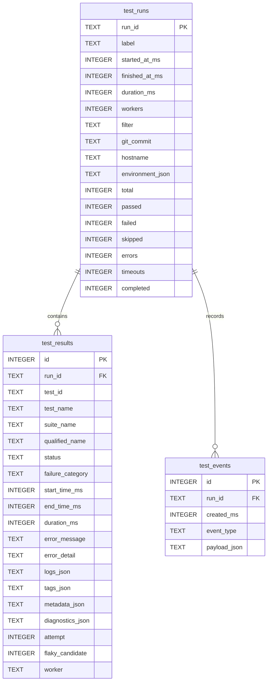

# Database

Where results go, why SQLite, and how the analytics work.

- [Why SQLite](#why-sqlite)
- [The repository interface](#the-repository-interface)
- [Schema](#schema)
- [Migrations](#migrations)
- [Pragmas](#pragmas)
- [Safety](#safety)
- [Analytics](#analytics)
- [Flake detection](#flake-detection)
- [Retention](#retention)
- [Adding PostgreSQL](#adding-postgresql)

---

## Why SQLite

A test tool should not require a server to be running before it can record a
result. With SQLite the database is a file: it travels with the workspace, CI can
upload it as an artefact, `sqlite3 testforge.db` works with no credentials, and
there is nothing to provision before the first run.

It is vendored as the [amalgamation](https://sqlite.org/amalgamation.html) via
CMake `FetchContent`, pinned by SHA-256, so `libsqlite3-dev` is not a
prerequisite. `TESTFORGE_USE_SYSTEM_SQLITE=ON` links a system copy instead.

**Persistence is optional.** `--no-db` or `database.enabled = false` runs
everything and skips storage. If the database cannot be opened, the service logs
it and continues with persistence disabled for the session — a run that cannot
be recorded is still a run whose results the user needs.

---

## The repository interface

The engine depends on `ResultRepository`, never on SQLite:

```cpp
class ResultRepository {
   public:
    virtual void initialise() = 0;
    virtual void beginRun(const TestRun&) = 0;
    virtual void saveResult(const TestResult&) = 0;
    virtual void completeRun(const TestRun&) = 0;
    virtual void recordEvent(const std::string& runId, const std::string& type,
                             const json::Value& payload) = 0;

    virtual std::optional<TestRun> loadRun(const std::string&) = 0;
    virtual std::vector<TestResult> loadResults(const std::string&) = 0;
    virtual std::vector<TestRun> listRuns(const RunQuery&) = 0;
    virtual std::vector<TestHistoryEntry> testHistory(const std::string&, int) = 0;
    virtual std::vector<TestHistorySummary> historySummaries(int) = 0;
    virtual json::Value aggregateStatistics(int runLimit) = 0;
    virtual int pruneOlderThan(int days) = 0;
    virtual json::Value storageInfo() = 0;
};
```

This is not speculative generality. The second implementation already exists —
`tests/fixtures/InMemoryRepository.hpp` — and it is what makes
`tests/integration/RunnerTest.cpp` possible: the entire engine, including
retries, fail-fast and persistence *ordering*, exercised with no database, no
schema and no file system.

**`beginRun` before, `saveResult` during, `completeRun` after.** Results are
written as each test finishes, not batched at the end, so an interrupted run
keeps what it already produced. `InMemoryRepository` counts the calls and a test
asserts the ordering.

---

## Schema



### Choices worth explaining

**`test_id` is a deterministic hash of suite + name**, not a row id. The same
test carries the same identity across runs and across machines, which is the
only reason history and flake analysis are possible at all.

**Timestamps are epoch milliseconds, stored as `INTEGER`.** Range queries become
integer comparisons, which are index-friendly and unambiguous about timezone.
ISO-8601 is generated at the presentation layer.

**Aggregate counts are denormalised onto `test_runs`.** Listing 50 runs must not
load 50,000 result rows. `listRuns` reads the stored counts; `loadRun` reads the
detail.

**JSON columns for `metadata`, `diagnostics`, `logs` and `tags`.** These are
genuinely schemaless — a test records whatever facts it likes. SQLite is compiled
with `SQLITE_ENABLE_JSON1`, so `json_extract` is available for ad-hoc queries.
Every one is size-capped on write, so one pathological result cannot bloat the
file.

**`ON DELETE CASCADE` with `PRAGMA foreign_keys = ON`.** Pruning a run removes
its results and events in one statement.

### Indices

| Index | Serves |
|---|---|
| `idx_test_runs_started (started_at_ms DESC)` | `history`, the dashboard, `stats` — the most common query in the product |
| `idx_test_results_run (run_id)` | loading one run's results |
| `idx_test_results_test (test_id, start_time_ms DESC)` | per-test history and flake analysis |
| `idx_test_results_status` | "show me the failures" |
| `idx_test_results_category` | the failure-category breakdown |
| `idx_test_events_run (run_id, created_ms)` | the per-run timeline |

---

## Migrations

Forward-only, tracked in a `schema_version` table, applied inside a transaction:

```cpp
struct Migration {
    int version;
    std::string description;
    std::string sql;
};
```

`initialise()` applies anything the file has not seen and is idempotent — calling
it twice applies nothing the second time
(`Repository.MigrationIsIdempotent`).

**Migrations are append-only.** Once a version ships, its SQL is never edited: a
database that already applied it will never see the change.

---

## Pragmas

```sql
PRAGMA journal_mode = WAL;      -- readers do not block the writer
PRAGMA synchronous  = NORMAL;   -- a small durability window for a large speedup
PRAGMA foreign_keys = ON;       -- cascading deletes actually cascade
PRAGMA temp_store   = MEMORY;
```

**WAL** is the important one: the dashboard and `testforge history` can read
while a run is writing. Without it, every read would block behind the writer.

**`synchronous = NORMAL`** trades a tiny window on power loss for a large write
speedup. Acceptable here: test results are reproducible by re-running.

Compile-time options are set in `cmake/Dependencies.cmake`:
`SQLITE_THREADSAFE=1` (serialized), `SQLITE_ENABLE_JSON1`, `SQLITE_DQS=0` (reject
double-quoted string literals), `SQLITE_OMIT_LOAD_EXTENSION` (no run-time
extension loading), `SQLITE_DEFAULT_FOREIGN_KEYS=1`.

---

## Safety

**RAII throughout.** `db::Connection`, `db::Statement` and `db::Transaction` each
own exactly one resource and release it on every path, including exceptions. The
transaction destructor rolls back unless `commit()` was called.

**Parameterised queries, always.** `Statement` has no interface for splicing text
into SQL:

```cpp
db::Statement insert(connection,
    "INSERT INTO test_results (run_id, test_name, error_message) VALUES (?, ?, ?);");
insert.bindAll(runId, testName, errorMessage);
insert.execute();
```

`SQLITE_TRANSIENT` on every string bind, so the caller's buffer does not have to
outlive the statement — getting that wrong is the classic source of garbage rows.

`Repository.ConcurrentWritesAreSerialised` runs four threads × 25 inserts and
checks all 100 arrive. `Database.ParametersAreBoundNotInterpolated` inserts
`Robert'); DROP TABLE t;--` and checks the table survives.

**Thread safety** is one connection behind one mutex. A write takes microseconds
while a test takes milliseconds, so the lock is never the bottleneck, and the
transaction semantics stay obvious.

---

## Analytics

```bash
testforge stats --runs 50
testforge history --limit 20
testforge history --test api.health_check
testforge stats --flaky
testforge db info
```

`aggregateStatistics(runLimit)` returns totals and success rate over the last N
runs, the failure-category breakdown, the top 10 failing tests, the 10 slowest by
average duration, and a per-run trend series for the dashboard sparkline.

**Success rate excludes skipped tests.** Counting a skip as a failure would
punish a machine for not having a GPU; counting it as a pass would overstate
coverage. The denominator is `total - skipped`.

Durations use **nearest-rank percentiles** rather than interpolation — with
small test counts, interpolating between samples that do not exist is worse than
reporting one that does.

`testHistory` accepts either the stable id or the qualified name, because a
person reading a report has the name.

---

## Flake detection

**A heuristic, labelled as one wherever it appears.**

A test is flagged when all of these hold over its last 50 non-skipped runs:

- at least **5** runs;
- at least one pass **and** at least one failure;
- the outcome changed on at least **20%** of consecutive transitions.

```cpp
bool TestHistorySummary::looksFlaky(int minimumRuns, double threshold) const {
    return totalRuns >= minimumRuns && passes > 0 && failures > 0 &&
           flipRate >= threshold;
}
```

The minimum-run requirement is not incidental: a single pass followed by a single
fail gives a flip rate of 1.0 and would otherwise be announced as maximally
flaky. `Repository.FlakeHeuristicIgnoresTooFewRuns` pins that.

**Why it is only a heuristic.** The same alternating pattern appears when a real
bug is intermittent, when a dependency was down for an hour, or when two tests
race over shared state. TestForge flags *candidates*; it does not diagnose. The
caveat is in the API payload itself, not only in this document:

```json
{
  "candidates": [ ... ],
  "method": "A test is flagged when it has at least 5 non-skipped runs, has both
             passed and failed, and changed outcome on at least 20% of
             consecutive runs. This is a heuristic: an intermittently broken
             feature produces the same pattern."
}
```

There is a second, independent signal: `flaky_candidate` is set on a result that
**passed only after a retry**, which is direct evidence rather than inference.

---

## Retention

```bash
testforge db prune --days 90        # or: testforge history --prune --days 90
```

Deletes runs older than N days; `ON DELETE CASCADE` takes their results and
events, and `VACUUM` reclaims the space. `database.retention_days` sets the
default.

Rough sizing: a passing result is ~1 KB; a failing one with diagnostics is
5–50 KB. A thousand runs of a hundred mostly-passing tests is on the order of
100–200 MB. Prune, or use a separate database per branch.

---

## Adding PostgreSQL

Not implemented, and deliberately so — adding a datastore with no use case is
technology for its own sake. The interface makes it a new class rather than a
refactor:

1. Implement `ResultRepository` over libpq.
2. Translate the schema: `TEXT` → `VARCHAR`/`TEXT`, `INTEGER` epoch millis →
   `BIGINT` or `TIMESTAMPTZ`, JSON columns → `JSONB` (which would make the
   metadata queries considerably better).
3. Choose it in `TestForgeService::initialise()` from a config field.

Nothing in `TestRunner`, the reporters or the CLI would change — they only ever
see the interface. That is the property the abstraction was for.
