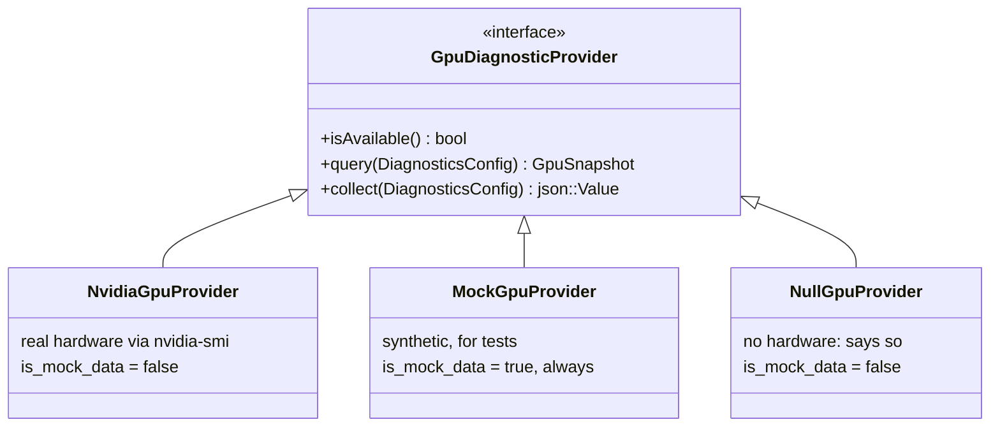

# GPU diagnostics

NVIDIA GPU state, and what happens when there is no GPU.

- [The three rules](#the-three-rules)
- [Providers](#providers)
- [What is collected](#what-is-collected)
- [Why nvidia-smi and not NVML](#why-nvidia-smi-and-not-nvml)
- [Parsing](#parsing)
- [Absence](#absence)
- [The mock provider](#the-mock-provider)
- [GPU tests](#gpu-tests)
- [Verification status](#verification-status)

---

## The three rules

Everything here follows from three commitments, each enforced in code and
asserted in tests.

**1. Nothing is ever invented.** No GPU means `available: false` with a reason.
There is no code path that produces a plausible-looking number when the real one
could not be read.

**2. Mock data is always labelled.** Every `GpuSnapshot` carries
`is_mock_data`, it is emitted on every serialisation, and every reporter
surfaces it — the HTML report prints a warning banner above the section.

**3. Real hardware is never assumed.** GPU tests **skip** without a GPU. A
skipped GPU test on a laptop is the correct result; a passing one would be a lie.

```
$ testforge diagnose --gpu

GPU
  GPU diagnostics unavailable: No NVIDIA GPU detected (nvidia-smi is not
  installed on this machine).
```

On a machine with hardware:

```
GPU
  2x NVIDIA A100-SXM4-40GB (driver 550.54.14, CUDA 12.4)

IDX  NAME                    MEMORY              UTIL  TEMP
  0  NVIDIA A100-SXM4-40GB   1024 / 40960 MB      37%   42C
  1  NVIDIA A100-SXM4-40GB  20480 / 40960 MB      95%   71C
```

---

## Providers



`createDefaultGpuProvider()` returns `NvidiaGpuProvider` when `nvidia-smi` is on
`PATH`, and `NullGpuProvider` otherwise. **It never returns the mock.**
Synthetic values enter only when a test installs them explicitly:

```cpp
collector->setGpuProvider(std::make_shared<MockGpuProvider>(2));
```

Asserted by `DefaultGpuProvider.IsNeverTheMock`.

---

## What is collected

| Field | Source |
|---|---|
| Device index, name, UUID | `--query-gpu=index,name,uuid` |
| Driver version | `--query-gpu=driver_version` |
| CUDA version | `nvidia-smi --version` (not exposed by the CSV query) |
| Memory total / used / free (MB) | `--query-gpu=memory.total,memory.used,memory.free` |
| GPU and memory utilisation (%) | `--query-gpu=utilization.gpu,utilization.memory` |
| Temperature (°C) | `--query-gpu=temperature.gpu` |
| Power draw (W) | `--query-gpu=power.draw` |
| Compute processes | `--query-compute-apps=pid,process_name,used_memory` |

```json
{
  "available": true,
  "is_mock_data": false,
  "source": "nvidia-smi",
  "driver_version": "550.54.14",
  "cuda_version": "12.4",
  "device_count": 1,
  "devices": [
    {
      "index": 0,
      "name": "NVIDIA A100-SXM4-40GB",
      "memory_total_mb": 40960,
      "memory_used_mb": 1024,
      "utilization_percent": 37.0,
      "temperature_celsius": 42.0,
      "power_draw_watts": 68.55
    }
  ],
  "summary": "1x NVIDIA A100-SXM4-40GB (driver 550.54.14, CUDA 12.4)"
}
```

---

## Why nvidia-smi and not NVML

Linking `libnvidia-ml` would make the whole build depend on a driver package
being installed. That defeats the goal: TestForge has to build and run on
machines with no NVIDIA driver present, and say so.

`nvidia-smi` is present wherever the driver is, and its
`--query-gpu=... --format=csv,noheader,nounits` mode is a stable, documented,
parseable contract.

**The invocation is fixed and safe.** It goes through `ProcessRunner`: a fixed
executable name resolved on `PATH`, a fixed argument vector, no shell, a
timeout, and an output cap. Nothing from a test, a configuration file or a
language model reaches this command line.

```cpp
std::vector<std::string> NvidiaGpuProvider::queryArguments() {
    return {"--query-gpu=index,name,uuid,driver_version,memory.total,...",
            "--format=csv,noheader,nounits"};
}
```

Asserted by `NvidiaGpu.QueryArgumentsAreFixed`.

---

## Parsing

Separated from the process invocation, so it can be unit-tested against captured
output on a machine with no GPU:

```cpp
static std::vector<GpuDevice> parseQueryCsv(const std::string& csv);
static std::vector<GpuProcessInfo> parseComputeAppsCsv(const std::string& csv);
```

Two behaviours worth calling out.

**`[N/A]` stays unknown.** Cards without a given sensor print `[N/A]` or
`[Not Supported]`. Those become `-1` and are omitted from the JSON — never `0`,
which would render as "this GPU is at 0°C".

```
0, NVIDIA T400, GPU-xyz, 535.104.05, 4096, 512, 3584, [N/A], [N/A], [N/A], [Not Supported]
```
→ memory present; utilisation, temperature and power absent.

**Malformed rows are skipped, not guessed at.** A row with too few fields is
dropped rather than partially parsed.

---

## Absence

The reason is always specific, because the fix differs:

| Situation | Reported reason |
|---|---|
| `nvidia-smi` not on `PATH` | "nvidia-smi was not found on PATH, so no NVIDIA driver is installed on this machine." |
| Command did not respond in time | "nvidia-smi did not respond within Nms; the driver may be wedged" |
| Non-zero exit | The command's own stderr, verbatim — usually a driver/library version mismatch after an upgrade without a reboot |
| Ran fine, reported no devices | "…no NVIDIA GPU is visible to this process; under WSL or in a container the device may not be passed through" |

That last one is the case this project actually hits: WSL2 without GPU
passthrough. Distinguishing "no driver" from "driver present, device not
visible" is the difference between installing something and changing a container
flag.

---

## The mock provider

`MockGpuProvider` exists so the GPU **code paths** can be tested where the
hardware cannot: CSV parsing, snapshot serialisation, report rendering, the REST
endpoint, and the AI failure context.

Every snapshot it produces is marked:

```cpp
snapshot.source = "mock";
snapshot.isMockData = true;
```

and the marking survives everywhere:

- `GpuSnapshot::summary()` prefixes `[MOCK TEST DATA]`;
- `toJson()` always emits `is_mock_data`, even when false, so a consumer can
  check one field rather than infer from the source;
- `HtmlReporter` prints a warning banner;
- the dashboard prints a warning line;
- the AI failure context preserves the flag.

Device names are `MOCK-GPU-*` and the UUID is `GPU-MOCK-…`, so even a raw JSON
dump is unambiguous. It can also simulate absence:

```cpp
MockGpuProvider provider;
provider.setUnavailable("simulated: driver/library version mismatch");
```

Asserted by `MockGpu.IsAlwaysLabelledAsMock` and
`HtmlReporter.WarnsWhenGpuDataIsMock`.

---

## GPU tests

`examples/sample_tests/GpuTests.cpp` — six tests that skip without hardware:

| Test | Checks |
|---|---|
| `driver_is_present` | `nvidia-smi` exists and reports a driver version |
| `devices_are_enumerated` | every device has a name and an index |
| `memory_is_visible_and_consistent` | used ≤ total, and used + free ≈ total within 5% (nvidia-smi rounds) |
| `utilization_is_within_range` | utilisation 0–100%, temperature < 130°C, power < 2000 W |
| `diagnostic_command_is_healthy` | the query responds in under 5 s with the expected shape |
| `absence_is_reported_honestly` | **runs everywhere** — checks the contract |

The last one is the interesting one. It runs on every machine and asserts the
*contract* rather than the hardware:

```cpp
ASSERT_FALSE(snapshot.isMockData);          // the real provider, always

if (snapshot.available) {
    ASSERT_TRUE(snapshot.unavailableReason.empty());
    ASSERT_FALSE(snapshot.devices.empty());
} else {
    ASSERT_FALSE(snapshot.unavailableReason.empty());
    ASSERT_TRUE(snapshot.devices.empty());   // nothing invented
    ASSERT_CONTAINS(snapshot.summary(), "unavailable");
}
```

Skipping is not silent. The reason lands on the result and in the report:

```
[  3/  6] SKIP  gpu.driver_is_present   0ms  no NVIDIA GPU detected
                                             (nvidia-smi is not on PATH)
```

Skipped tests are also excluded from the success-rate denominator, so a machine
without a GPU does not show a degraded pass rate for a correct outcome.

---

## Verification status

What is implemented, and what depends on hardware being present.

| | |
|---|---|
| **Verified** | CSV parsing against captured real `nvidia-smi` output, including multi-GPU rows and `[N/A]` fields |
| **Verified** | The absence path, on a machine with no NVIDIA GPU (WSL2) |
| **Verified** | Mock labelling end to end: snapshot → JSON → HTML → dashboard → AI context |
| **Verified** | The fixed argument vector, and that the invocation uses no shell |
| **Verified** | Timeout and non-zero-exit handling |
| **Not verified** | Execution against physical NVIDIA hardware — the development machine has none |

The sample output in this document uses realistic values in the A100 format; it
is illustrative of the layout, not a capture from a machine this project ran on.
Everything TestForge itself *emits* about a GPU is either measured or explicitly
flagged as mock.
