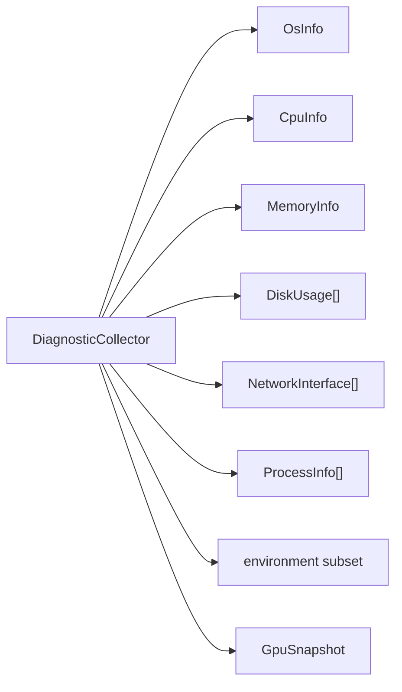

# Linux diagnostics

What TestForge collects when a test fails, where it comes from, and what happens
when it cannot be read.

- [Why](#why)
- [Sources](#sources)
- [What is collected](#what-is-collected)
- [Unknown is not zero](#unknown-is-not-zero)
- [When it runs](#when-it-runs)
- [Security](#security)
- [Container and WSL detection](#container-and-wsl-detection)
- [Permissions](#permissions)
- [Extending it](#extending-it)

---

## Why

A test failed at 03:14. Was the machine out of memory? Was the disk full? Was
the load average 40? By the time anyone looks, the answer is gone.

TestForge captures the machine's state **at the moment of failure** and stores it
with the result, so the question is answerable later.

```
$ testforge diagnose

Operating system
  distribution          Ubuntu 22.04.5 LTS
  kernel                6.18.33.2-microsoft-standard-WSL2
  architecture          x86_64
  hostname              build-01
  uptime (s)            121
  in container          no
  container hint        running under WSL

CPU
  model                 Intel(R) Core(TM) i3-4005U CPU @ 1.70GHz
  logical cores         4
  physical cores        2
  load (1m)             1.59
  utilization %         0.00

Memory
  total (kB)            3959412
  available (kB)        3443604
  used %                13.03
  testforge rss (kB)    5948

Filesystems
MOUNT                  TOTAL    FREE  USED
/                     1006 GB  944 GB    1%
/tmp                  1006 GB  944 GB    1%

Network
  lo                    127.0.0.1, ::1
  eth0                  172.28.1.42, fe80::215:5dff:fe4a:...

GPU
  GPU diagnostics unavailable: No NVIDIA GPU detected (nvidia-smi is not
  installed on this machine).
```

---

## Sources

Everything comes from the kernel's own interfaces. There is no shelling out to
`top`, `free`, `df` or `ps`.

| Data | Source |
|---|---|
| OS, kernel, hostname, architecture | `uname(2)` |
| Distribution | `/etc/os-release` (`PRETTY_NAME`) |
| Uptime | `/proc/uptime` |
| CPU model, MHz, physical cores | `/proc/cpuinfo` |
| Logical cores | `sysconf(_SC_NPROCESSORS_ONLN)` |
| Load averages | `/proc/loadavg` |
| CPU utilisation | two samples of `/proc/stat`, 120 ms apart |
| Memory and swap | `/proc/meminfo` |
| Process RSS | `/proc/self/status` (`VmRSS`) |
| Mounted filesystems | `/proc/mounts` |
| Filesystem usage | `statvfs(3)` |
| Network interfaces and addresses | `getifaddrs(3)` |
| Interface counters | `/sys/class/net/*/statistics/{rx,tx}_bytes` |
| Process list | `/proc/<pid>/{status,stat}` |
| Executable path | `/proc/self/exe` |
| System logs *(opt-in)* | `journalctl` or `dmesg` |

**Why parse files instead of running commands:** it is faster (no fork, no exec,
no shell); it is independent of which coreutils flavour is installed; it is
immune to locale differences in number and date formatting; and it removes an
entire class of command-injection risk by not building a command line at all.

The one exception is system logs, which have no file equivalent. Both
`journalctl` and `dmesg` go through `ProcessRunner` with a fixed argument
vector, and both are off by default because they usually require privileges.

---

## What is collected



**Always:** OS identity, kernel, architecture, hostname, uptime, container and
WSL detection; CPU model, topology, load averages, sampled utilisation; memory
and swap totals plus the process's own RSS; filesystem usage; network interfaces
with addresses and byte counters; the executable path, working directory and
PID; a curated slice of the environment.

**Opt-in:** `diagnostics.include_processes` adds the top N processes by resident
memory (off by default — verbose and privacy-sensitive);
`diagnostics.include_system_logs` adds recent warning-level entries (off by
default — usually needs privileges).

The **failure** payload is a trimmed version of the full one: only filesystems
at ≥85% usage or holding `/` or `/tmp`, and only interfaces that are up. It is
stored next to *every* failing result, so its size is multiplied by the number
of failures.

---

## Unknown is not zero

Every numeric field defaults to `-1` and is **omitted** from JSON when unknown:

```cpp
struct MemoryInfo {
    std::int64_t totalKb = -1;
    std::int64_t availableKb = -1;
    // ...
    [[nodiscard]] double usedPercent() const;   // -1.0 when unknowable
};
```

Anything that could not be read is collected into an explicit list:

```json
{
  "memory": { "total_kb": 3959412, "available_kb": 3443604 },
  "unavailable": [
    "process list (/proc not enumerable)",
    "executable path (/proc/self/exe unreadable)"
  ]
}
```

**Why this matters.** "0 MB of memory available" and "we could not read memory"
are completely different findings. A report that renders them identically will
mislead somebody at 03:14. Inside a container with a masked `/proc`, TestForge
reports what it could not read rather than reporting zeroes.

Verified by `LinuxDiagnostics.UnknownValuesAreAbsentRatherThanZero`.

---

## When it runs

| Trigger | Scope |
|---|---|
| A test fails, and `diagnostics.collect_on_failure` is true (default) | trimmed failure payload |
| `testforge diagnose` | everything |
| `GET /api/diagnostics` | everything |
| A test passes | **nothing** |

Collection costs 100–300 ms, mostly the CPU sampling window and, when present,
`nvidia-smi`. For a suite of 500 fast tests, collecting for every one would add
minutes of pure overhead — and nobody reads the diagnostics for a passing test.

Turn it off entirely with `--no-diagnostics` semantics via config, or per run
with `RunOptions::collectDiagnostics`.

---

## Security

`collect()` is declared `noexcept` and means it. Diagnostics run while a failure
is *already* being handled; an exception here would replace the real failure with
a less interesting one. Every provider wraps its work and reports problems as
data:

```json
{ "error": "system diagnostics failed: <what happened>" }
```

Environment capture uses a **curated allow-list**, not a filter:

```cpp
constexpr std::array<std::string_view, 16> kDiagnosticNames = {
    "PATH", "HOME", "USER", "SHELL", "LANG", "LC_ALL", "PWD", "HOSTNAME",
    "CI", "GITHUB_ACTIONS", "GITHUB_RUN_ID", "container",
    "CUDA_VISIBLE_DEVICES", "NVIDIA_VISIBLE_DEVICES",
    "TESTFORGE_CONFIG", "TESTFORGE_ENV" };
```

Anything not on the list is omitted rather than redacted, so a variable nobody
anticipated cannot leak. `env::snapshotRedacted()` additionally masks any
variable whose *name* looks sensitive, and values pass through `redactSecrets`.

The process list, when enabled, reports names and RSS — not command lines, which
routinely contain credentials.

---

## Container and WSL detection

Both change how a failure should be read, so both are reported.

| Signal | Conclusion |
|---|---|
| `/.dockerenv` exists | container |
| `/proc/1/cgroup` mentions `docker`, `kubepods` or `containerd` | container |
| The `container` environment variable is set | container |
| Kernel release or version mentions `microsoft`/`WSL` | WSL |

None of these is authoritative on its own, so TestForge records **which signal
fired** in `container_hint` rather than claiming certainty:

```json
{ "inside_container": false, "container_hint": "running under WSL" }
```

WSL is called out specifically because it behaves like Linux but has no GPU
passthrough by default and a virtualised clock — both of which change how a
GPU-related or timing-related failure should be interpreted.

---

## Permissions

TestForge assumes **no privileges** and degrades cleanly:

| Situation | Behaviour |
|---|---|
| `kernel.dmesg_restrict=1` | `dmesg unavailable (kernel.dmesg_restrict is commonly set to 1)` |
| Not in the `systemd-journal` group | `journalctl unavailable (…) — this normally means the current user is not in the systemd-journal group` |
| Another user's `/proc/<pid>/status` unreadable | that process is skipped |
| A process exits between `readdir` and `open` | skipped silently — this is normal and not an error |
| `/proc` masked in a container | listed in `unavailable` |

The engine Docker image runs as a non-root user for exactly this reason: running
a test tool as root is an unnecessary risk, and the diagnostics are designed not
to need it.

---

## Extending it

Implement `DiagnosticProvider` and register it:

```cpp
class KubernetesProvider final : public diagnostics::DiagnosticProvider {
   public:
    std::string_view name() const override { return "kubernetes"; }

    bool isAvailable() const override {
        // Cheap: must not run a command or block.
        return env::isSet("KUBERNETES_SERVICE_HOST");
    }

    json::Value collect(const DiagnosticsConfig& config) const noexcept override {
        // Must never throw.
    }
};

collector->addProvider(std::make_shared<KubernetesProvider>());
```

Output appears under the provider's name in the diagnostics blob, in the JSON
and HTML reports, and — if it is small and relevant — in the AI failure context.

Two contracts to respect: `isAvailable()` must be cheap, and `collect()` must
never throw.
